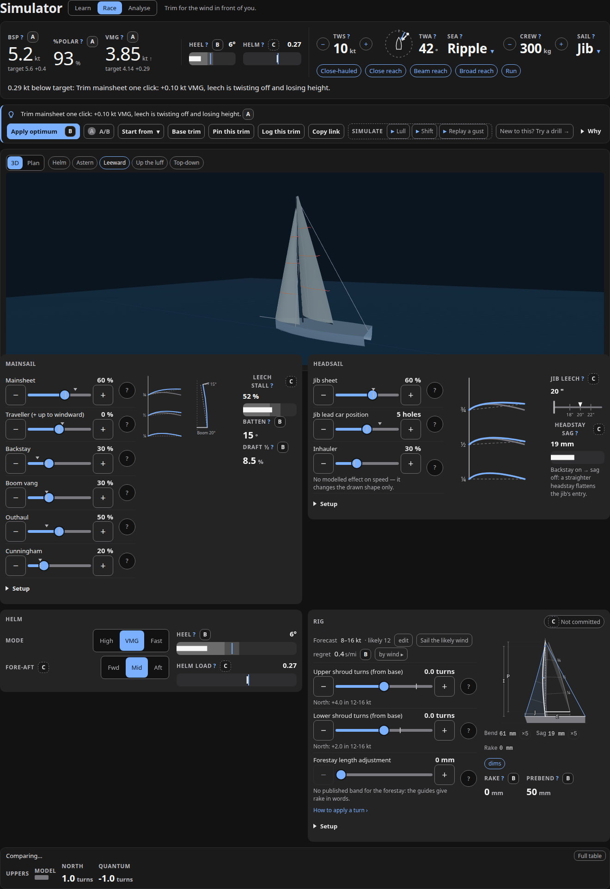
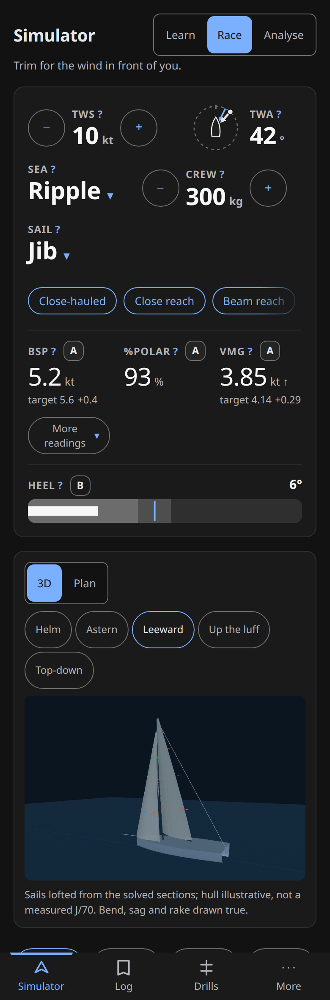

# Sailflow

A free, browser-based rig-tune and sail-trim trainer for one-design
sportboats — the J/70 first, the Melges 24 second. No backend, no account,
works offline on a phone after the first visit.

## ▶ Try it: **[rjdscott.github.io/sailflow](https://rjdscott.github.io/sailflow/)**

[](https://rjdscott.github.io/sailflow/)

*The Simulator at 10 kt, close-hauled. The right half of the instrument band
is the world — wind speed, the rose you drag for angle, sea state, crew, sail
set — and every value in it is the control that sets it; the left half is what
the boat does about it. The Rig panel carries the forecast the tune is bet on
and the three shroud turns. Every number wears its confidence tier (A/B/C).*

Sailflow answers two questions a one-design crew asks every race day:

- **The rig** — *what shroud, rake and forestay setting do I commit to for
  today's forecast, and what does it cost me at each end of the range?*
- **The sails** — *with the rig I have, where do the sheets, traveller,
  backstay, vang, outhaul, cunningham, leads and kite controls go for the wind
  in front of me, and what does each move do to the sail?*

Both are answered on one page, the **Simulator** at
[`#/sim`](https://rjdscott.github.io/sailflow/#/sim) — rig and sails on the
same screen, so a shroud turn and its effect on the jib are visible together
([ADR 0021](docs/adr/0021-dock-and-race-merge-into-one-simulator-page.md)).
Links written against the old `#/race` and `#/dock` URLs still open.

It solves a steady-state velocity-prediction model (VPP) in a Web Worker, draws
the flying shape of every sail in 3D and plan view, compares its answer against
the North and Quantum tuning guides, logs what you tried, and drills you on
the decisions with fault-injection exercises. Trim states are shareable as
links; a pinned trim shows as a ghost outline with deltas.

<p align="center"></p>

<p align="center"><em>390 px wide, the top 1180 px of the page: the conditions
are the first thing you touch, the boat's numbers are under them, then the
picture. The whole instrument band is inside an 844 px phone screen.</em></p>

## Why it is different

Most trim advice is a table in a PDF. Sailflow is a model you can argue with:

- **Every number carries a confidence tier.** A = a number you can use; B = a
  direction and a band; C = a direction only. Tiers are computed, not
  asserted — an output is demoted the moment its inputs leave the calibrated
  envelope.
- **Provenance is enforced.** Every literal in the physics core has a `prov:`
  tag or a row in [`ASSUMPTIONS.md`](ASSUMPTIONS.md); a script fails CI if
  one is missing. Third-party data is committed one file per source with its
  citation in [`PROVENANCE.md`](PROVENANCE.md).
- **Disagreement is shown, never resolved silently.** When the model and a
  tuning guide differ, you see both and the delta.
- **Validation is public.** [`validation/report.md`](validation/report.md)
  replays the ORC J/70 polar through the solver with two wind speeds held out
  of the fit. CI regenerates it on every push and puts the held-out tables and
  the gate verdict in the job summary, so a regression is visible in the PR.
  The current verdict, and the rows it fails, are below.
- **Deterministic core.** Same inputs, same outputs. No randomness, no clock,
  no framework in `src/core`. A golden corpus of solved cases per boat catches any
  drift.

## Current state (v0.5.1, 2026-08-28)

Complete and live: one **Simulator** page with the 3D hero (three.js,
lazy-loaded, first-frame budget) — the conditions are the editable right half
of the instrument band, the Rig panel carries the forecast, the expected regret
of committing once, the three shroud turns and the commit lock, and the
mainsail, headsail/gennaker and helm panels sit around the boat (ADR 0021).
Plus: disagreement panel driven by whatever guides are in `data/tuning/`,
tuning log with export/import, drills v2, PWA offline, dark/light themes,
desktop-first layout down to phone. Phase two added shareable trim links and
pin-and-compare (ADR 0019), a first-run tour and a schematic explainer for
every control, a downwind model that soaks (ADR 0018), a boat picker with the
Melges 24 as a second class (ADR 0020), and a phone that loads the 3D chunk
only when asked.

**Where it stands, stated plainly.** The polar hold-out gate
([ADR 0012](docs/adr/0012-hold-out-split-by-wind-speed-not-by-angle.md): every
row at TWS 8 and 14 kt withheld from calibration) reads **PASS — 10 of 10
rows** on the J/70: boat speed within 3 % (VMG rows) and 5 % (60/90/120° rows),
and every VMG row within 1 % of its own best VMG when sailed at the polar's
printed angle. Two things closed it, and neither is a loosened tolerance:

- **Heel now costs published drag** ([ADR 0022](docs/adr/0022-heel-costs-published-drag-and-nothing-fits-the-heel-column.md)).
  The polar's upwind speed plateaus at 5.89–5.95 kt from 14 to 20 kt and the
  model used to plateau at 6.23–6.34, ~6 % fast on the held-out row and on the
  fitted 16 and 20 kt rows alike. The heel term was anchored on viscous
  resistance and could not reach the penalty the plateau needs; on the published
  Delft heel law it can. Held-out TWS 14 upwind is now 0.9 % fast.
- **The VMG-angle criterion measures knots, not degrees**
  ([ADR 0023](docs/adr/0023-vmg-gate-measures-vmg-lost-at-the-polars-angle.md)).
  The last failing row was 3.3° from a 2° tolerance on a VMG curve flat to
  0.11 % over 168–172° — sailed at the polar's own 172° the model gives up
  0.06 kt of 6.27. Each VMG row is now solved a second time at the polar's
  printed angle and must keep 99 % of its own best VMG.

What is still wrong is on the record rather than in the gate: the model's
downwind optimum is compressed into 168–169° from 14 kt up while the polar's
spans 141.9–174.0°, and closing that needs a second mechanism, not a better
number. Written up in
[`ASSUMPTIONS.md`](ASSUMPTIONS.md#where-the-model-is-honestly-weak-2026-08-26-fit-adr-0018).
The Melges 24 gate is 8 of 10, on two boat-speed rows
([`validation/report-m24.md`](validation/report-m24.md)).

Downwind boat speed stays tier B and downwind optimum angle tier C: the two
gated downwind rows now pass on boat speed (0.1 % and 1.9 %), but they pass at
an angle the model still picks 3° hot, which is not enough to promote a tier.
The app says so on screen. Phase 01 of
[the phase-two plan](docs/plans/2026-08-26-phase-two/) carries the detail.

## Model

The aero layer is the documented ORC VPP parametric model (2023 edition,
[`PROVENANCE.md`](PROVENANCE.md)) with an explicitly **invented** layer on top
that maps rig bend, headstay sag and sheet positions to sail draft, draft
position and twist, and those to ORC's `flat`, `reef` and effective twist.
There is no public evidence base for that layer on a J/70; it is calibrated
against the ORC polar and labelled tier B or C throughout. Hydro is ORC's
canoe-body and appendage resistance with added resistance in waves.
[ADR 0006](docs/adr/0006-faithful-orc-aero-layer-plus-invented-shape-layer-with-confidence-tiers.md)
records the split; `ASSUMPTIONS.md` "Where the model is honestly weak" lists
what a sailor should not trust.

Parametric VPPs under-predict boat speed relative to CFD tools. This is a
decision-rehearsal tool for tuning and trim choices, not a wind tunnel.

## Quick start

```bash
make setup      # pnpm install --frozen-lockfile
make dev        # vite dev server on http://localhost:5173
make check      # docs-check + lint + typecheck + 1100+ unit tests
make validate   # polar hold-out gate, regenerates validation/report.md
make help       # every target

pnpm exec playwright install chromium   # once, before the first test:ui run
pnpm test:ui    # Playwright: layout, a11y, 3D smoke, screenshots
```

Node 20, pnpm 9, and [`uv`](https://docs.astral.sh/uv/) — `make docs-check`
runs the documentation tests through `uvx pytest`, so `make check` needs it:

```bash
curl -LsSf https://astral.sh/uv/install.sh | sh
```

Python 3.12 is used only by that docs tooling. Playwright screenshot baselines
are generated inside `mcr.microsoft.com/playwright:v1.62.1-noble` so they match
CI — see [`docs/runbooks/`](docs/runbooks/README.md).

## Architecture

```
src/core      pure physics — geometry, rig, shape, aero (ORC), hydro, solve
              no DOM, no framework, no Math.random, no Date
src/worker    the typed request/response protocol; the UI's only door to core
src/ui        Svelte 5 — simulator cockpit, log, drills, three.js hero
data/         boats, tuning guides, ORC polar: one JSON per source
calibration/  fits the invented-layer knobs to the polar; writes the golden corpus
validation/   replays the polar through the solver; hold-out gate; report
```

The core/UI boundary is enforced by ESLint (`no-restricted-imports`): the UI
may import only types from `src/core/types`
([ADR 0003](docs/adr/0003-ui-talks-to-physics-only-through-a-typed-worker-protocol.md)).
Solves run in a Web Worker with a fixed Newton budget and a fixed seed table,
so a solve is reproducible and never blocks the frame.

Stack: Svelte 5 runes, Vite, TypeScript strict, Vitest, Playwright,
three.js (one lazy chunk, gated by a measured first-frame budget), vite-plugin-pwa,
GitHub Pages. Two boat classes, 21 ADRs.

## Documentation

The repo is run on a documentation pipeline that is machine-checked
(`make docs-check`): research → decision → plan → audit, plus runbooks.

| Where | What |
|-------|------|
| [`docs/adr/`](docs/adr/README.md) | 21 decisions, Nygard format, immutable once accepted |
| [`docs/plans/`](docs/plans/README.md) | Phase plans with status tables; resumable by a stranger |
| [`docs/audits/`](docs/audits/README.md) | Point-in-time sweeps (UX ×4, docs consistency, first impressions) with evidence and punchlists |
| [`docs/research/`](docs/research/README.md) | Cockpit UX, spinnaker aerodynamics and trim, simulator landscape |
| [`docs/runbooks/`](docs/runbooks/README.md) | Nine operational how-tos: deploy, release and cache-bust, recalibrate, add a boat, add a drill, add a tuning guide, export the log, reshoot the screenshots, start a new project from the template |
| [`docs/initial-prompt.md`](docs/initial-prompt.md) | The original build brief and acceptance criteria |
| [`CHANGELOG.md`](CHANGELOG.md) | Per-release, from squash-merge titles |

Start with [`docs/plans/README.md`](docs/plans/README.md) for what is done and
what is next, and [`CLAUDE.md`](CLAUDE.md#this-project) for the engineering
rules.

One thing that corpus will not explain about itself: Sailflow was built
autonomously by Claude Code agents against a written brief, with the owner
reviewing and merging. That is why the plan progress logs and audit method
lines name models — Fable, Opus, Sonnet — as the party that did a piece of
work. Those logs are dated, append-only records of what happened; they are
kept as written rather than tidied up, for the same reason the polar gate is
published while it still reads FAIL.

## What's next

Phase two and the Simulator merge are closed
([`docs/plans/2026-08-26-phase-two/`](docs/plans/2026-08-26-phase-two/),
[`docs/plans/2026-08-28-simulator/`](docs/plans/2026-08-28-simulator/)).
What they leave open, each with the reason written where it lives: the
downwind optimum angle (3° hot; needs a second mechanism, ADR 0018), a
helm/rudder-angle readout (needs a yaw balance in the core), a third J/70
tuning guide and any Melges 24 guide (none publicly fetchable), and the
Melges 24's own gate (7 of 10 rows; six knobs unfitted, ±11 % polar spread).

Out of scope, by the brief: multiplayer, race simulation, tactics, starts,
accounts, any backend.

## Contributing

Issues and PRs welcome, especially from J/70 and Melges 24 sailors with
measured numbers.
The rules are short: branch + PR + squash, `make check` green, every literal
carries provenance, every model output carries a tier, tests land with the
change. Details in [`CLAUDE.md`](CLAUDE.md#this-project) — the sections above
that heading are generic template conventions, not Sailflow's. To add a boat
class, follow
[`docs/runbooks/add-a-boat-class.md`](docs/runbooks/add-a-boat-class.md).

## Licence

MIT. See [`LICENSE`](LICENSE). Tuning-guide numbers are transcribed from
publicly available guides with attribution
([ADR 0008](docs/adr/0008-third-party-reference-data-committed-with-provenance.md));
if you own one of those guides and object, open an issue.
