# Race cockpit

Findings from the novice lens (Learn tier, Race + Drills) and the expert lens
(Analyse tier, Race + Dock), against ADR 0015's three commitments: a visual
beside the controls that move it, one instrument-cell contract, and one screen
with no scroll at 1280 px and wider.

### H-01 — Every sail-shape visual in the desktop cockpit renders in a 0 px box

**Evidence.** Measured at 1440×900 in the Learn tier, the `.visual` grid item of
the Mainsail, Headsail and Rig panels computes to `height: 0px` while its own
children measure full size: Mainsail child 333 px (two SVGs, 239 + 216), Headsail
320 px (SVG 260), Rig 289 px (SVG 200). Identical at 1280×720 and identical in
the Race tier. On a 390×844 phone the same three render at 352 / 303 / 289 px, so
the markup and the geometry are fine — the desktop layout collapses the box.

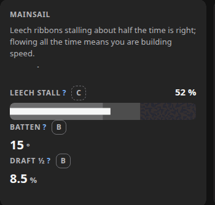

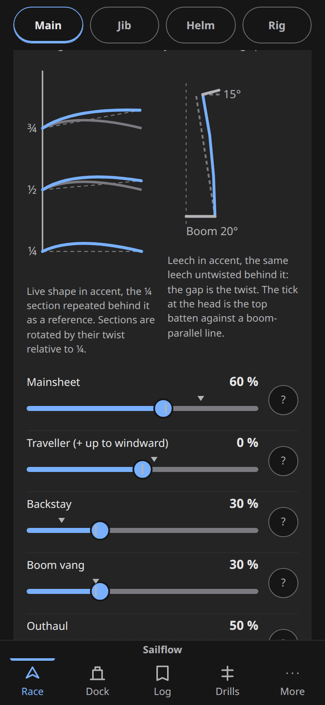

The refuter reproduced the measurements exactly and corrected the diagnosis. The
original finding blamed the `max-height: 220px` cap at
`src/ui/screens/Race.svelte:663-668`; injecting `.visual { max-height: none }`
leaves all three panels at 0 px. The cause is the auto row track inside
`.panel > .grid` (`src/ui/components/Panel.svelte:111-124`), which
`src/ui/screens/Race.svelte:643-651` makes `overflow-y: auto` in the cockpit
grid: the visual's row resolves to zero height and the overflow hides the
children that overflow it. `.visual { min-height: 140px }` restores all three
(`verify-visual-zero-height-desktop.png` series).

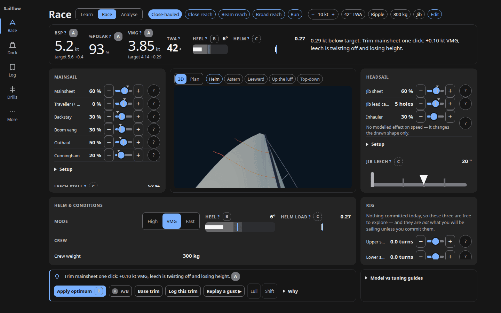

**Impact.** The one thing the cockpit was rebuilt to deliver — a picture of the
sail beside the controls that move it — is invisible at every scroll position on
the layout ADR 0015 calls the primary screen. The Mainsail panel's teaching
sentence about the leech has no leech drawing under it; the Learn tier's "live
shape in accent, the ¼ section repeated behind it as a reference" has no shape.
The failure is silent: the SVGs are in the DOM at full size, so any test that
queries them passes. `docs/plans/2026-08-25-cockpit/phase-06-phone-restyle-audit.md:147`
confirms the intent was a visible picture ("The panel's own visual is capped at
220 px and sits under them"), so this is a defect, not a known-undone item.

**Principle.** Research §3 principle 1 (put each visual immediately adjacent to
the controls that drive it — "strongest-supported claim in the report") and §4
pattern 4; ADR 0015's Decision clause "each pairing its controls with the one
visual and one feedback cue that those controls move".

**Fix.** Give the visual its own row: `min-height: 140px; max-height: 220px` on
`.p-main/.p-jib/.p-rig :global(.visual)`, or an explicit `grid-template-rows` on
the cockpit panel grid so the auto track cannot collapse. Then assert a non-zero
`.visual` height in `tests/ui/race.spec.ts` at 1280×720 and 1440×900 — the
existing one-screen assertion cannot catch a collapsed box, which is why this
shipped.

**Effort.** M.

**Lenses.** novice.

### H-02 — On Drills at ≥ 1280 px the instrument band's verdict is thrown off the card and two gauges are clipped

**Evidence.** `src/ui/race/InstrumentBar.svelte:265` switches `.bar` to a single
flex row on a `@media (min-width: 1280px)` **viewport** query, but
`src/ui/drills/DrillView.svelte:219-227` mounts that same band inside
`.col-secondary`, which `src/app.css:255-269` sizes at 5fr of `7fr 5fr` — about
503 px at a 1440 px viewport — and `.bar` is `overflow: hidden`
(`InstrumentBar.svelte:216`).

Measured at 1440×900, Race tier, first drill: `.bar` spans x 869 → 1372 with
`scrollWidth` 726 against `clientWidth` 501; `.gauges` spans 1249 → 1503, i.e.
131 px past the clip, so HELM is gone and HEEL's bullet bar is sliced; `.verdict`
sits at x 1519 with width 0 and is never rendered — after Check the sentence
"0.47 kt below target: main leech flowing, trim on" is simply absent from the
screen.

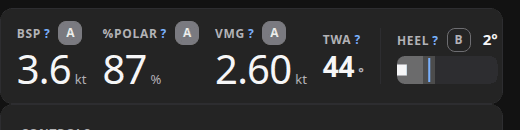

Learn is worse than the original finding stated. `order: -1`
(`InstrumentBar.svelte:334-338`) puts the verdict first, where it wraps one word
per line printed directly over the BSP cell; after Check `.gauges` measures
1386 → 1504, so **both** gauges and TWA are entirely outside the clip.

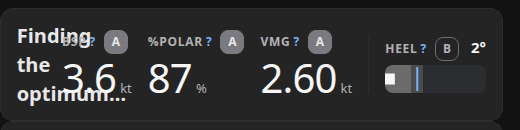

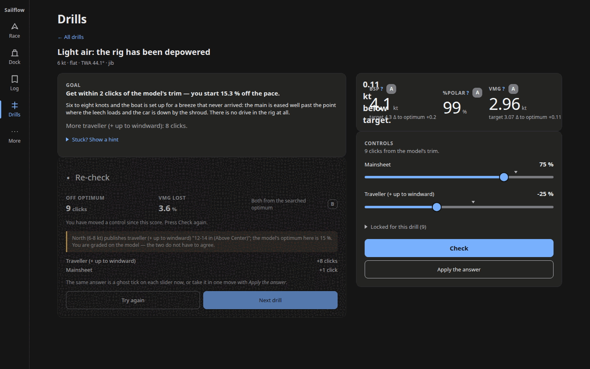

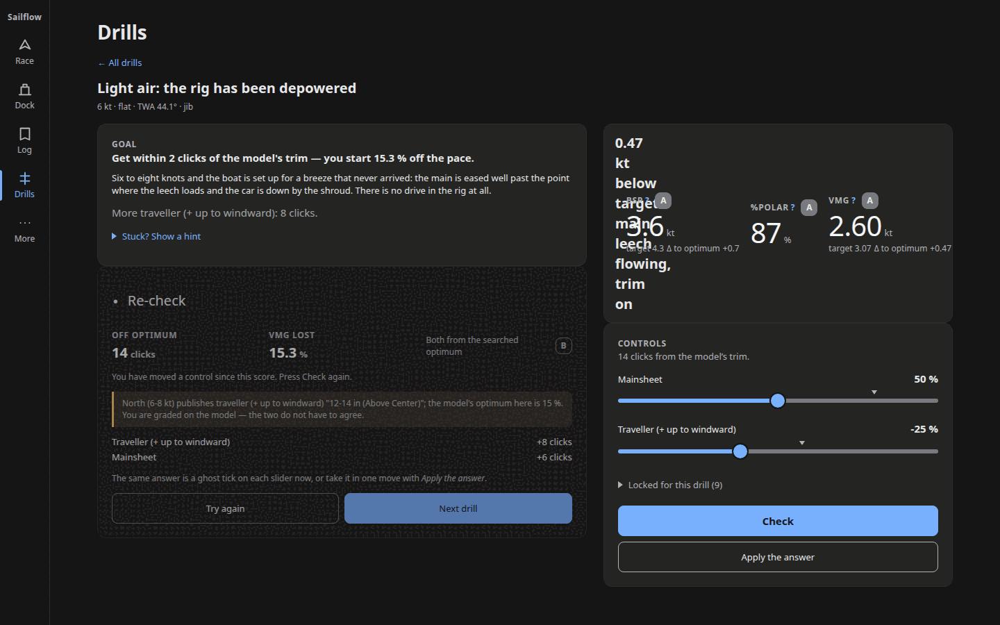

Phone 390×844 is correct — below 1280 px the media query does not apply.

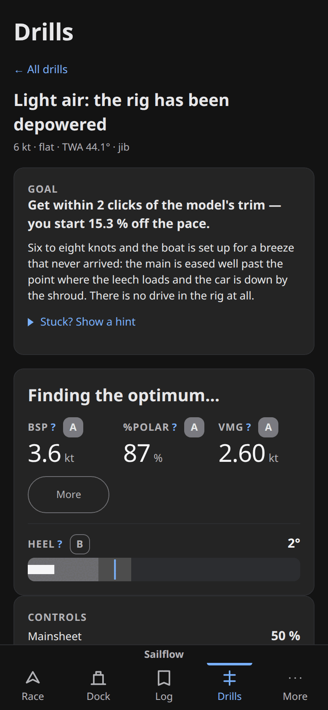

One correction from the refuter, which does not change severity: the drill's
actionable coach line ("More traveller (+ up to windward): 8 clicks.") renders
fine at full width in the Goal card (`DrillView.svelte:200`, measured x 161 →
824). What is lost is the instrument band's own verdict and the two gauges, not
all plain-language feedback.

**Impact.** The drill is the novice's guided path and this garbles its primary
readout. In Race tier the sentence explaining the score does not exist on screen
at all; in Learn tier it is overprinted on the boat-speed number it is meant to
explain.

**Principle.** Research §3 principle 25 and §2E — media queries for the page
grid, container queries for panel internals. This component breaks exactly the
rule the research names, and it is the outlier: `src/ui/components/Panel.svelte`
already uses `container-type: inline-size` (phase 01).

**Fix.** Put `container-type: inline-size` on `.bar` and change the 1280 px block
to `@container (min-width: 1000px)`. One-line-ish, and it fixes every future
reuse of the band. Add a Playwright assertion on the Drills route that no `.bar`
child's right edge exceeds the bar's.

**Effort.** S.

**Lenses.** novice.

### H-03 — The model-vs-guides panel is hard-clipped, so the disagreement is asserted and never shown

**Evidence.** `src/ui/screens/Race.svelte:613-616` sets
`.disagree { padding: …; overflow: hidden }` inside the
`@media (min-width: 1280px)` cockpit grid, where the panel occupies the last
`auto` row (`Race.svelte:536-552`, area `dis`). Measured with the panel
expanded: 1440×900 → `scrollHeight` 1257 against `clientHeight` 158, computed
`overflow-y: hidden`, zero scrollable descendants — 1099 px, 87 % of the panel,
unreachable. 1920×1080 → 1257 vs 338, still 73 % hidden. Twelve
`mouse.wheel(0, 400)` events with the cursor over the panel move `window.scrollY`
to 820 and leave `el.scrollTop` at 0.

What a reader gets is the lede, cut mid-sentence before a single Model / North /
Quantum number or Δ: *"These disagree. The model is calibrated to North at 8–10
and 12–16 kt (marked); elsewhere the gap is"*.

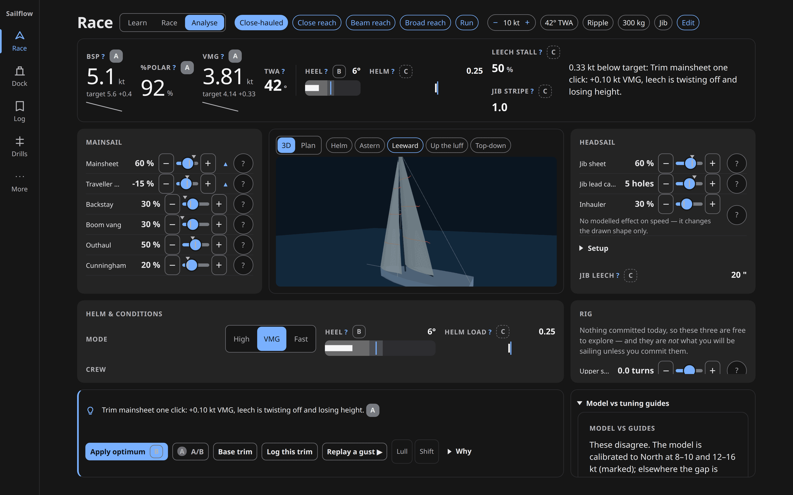

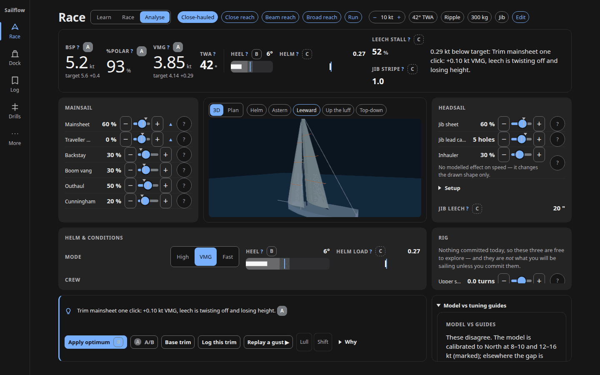

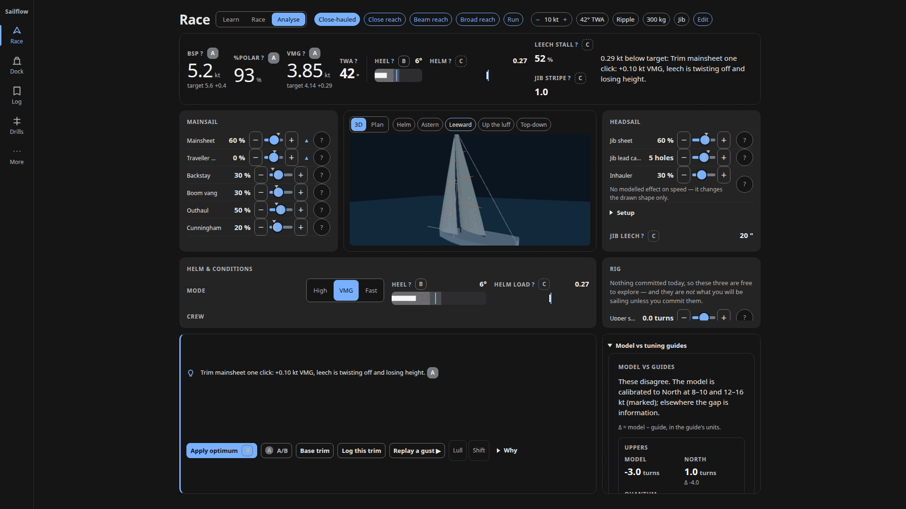

The refuter corrected the scope in two directions. It is **not** Analyse-only:
`settings.advanced` is `mode !== 'learn'` (`src/ui/stores/settings.svelte.ts:83`),
so the clip is present in the default Race tier too (measured 1257 / 195 at
1440×900). And there is a worse co-symptom the lens missed: opening the panel
grows `document.documentElement.scrollHeight` from 900 to 1720 at 1440×900 while
`.disagree` grows only 94 → 160 px, so the page gains 820 px of empty void and
reveals nothing — breaking the one-screen promise `Race.svelte:530-534` cites
research §3 principle 4 to justify.

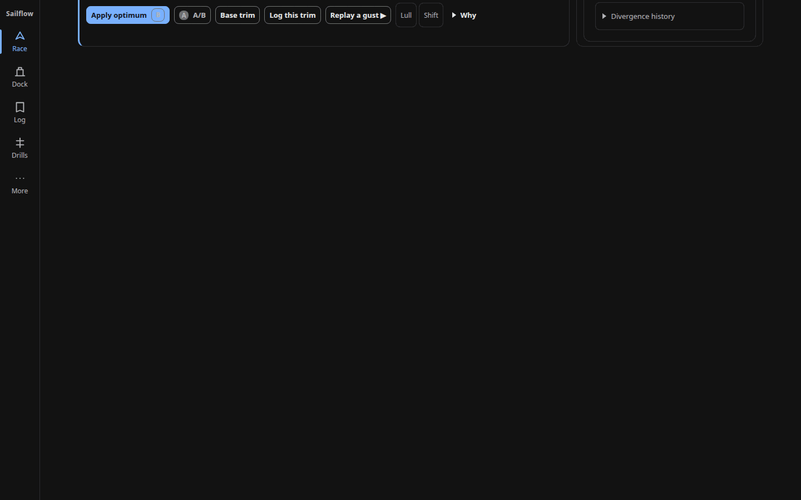

Bounded: below 1280 px the media query does not apply and the panel reads fine
(1005 / 1005, `overflow-y: visible` at 1200×900), and the identical panel renders
complete on Dock (813 / 813 at 1440×900, full table text present). That is why
this is High and not Critical — the honesty rule is defeated on one surface, not
in the product.

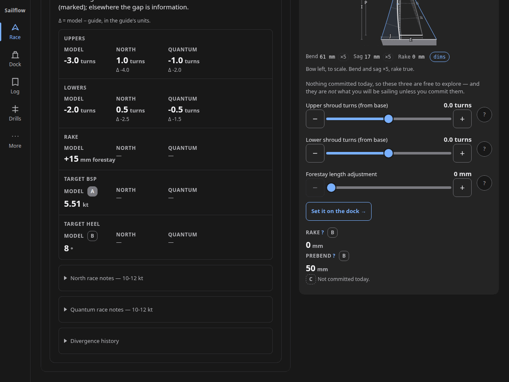

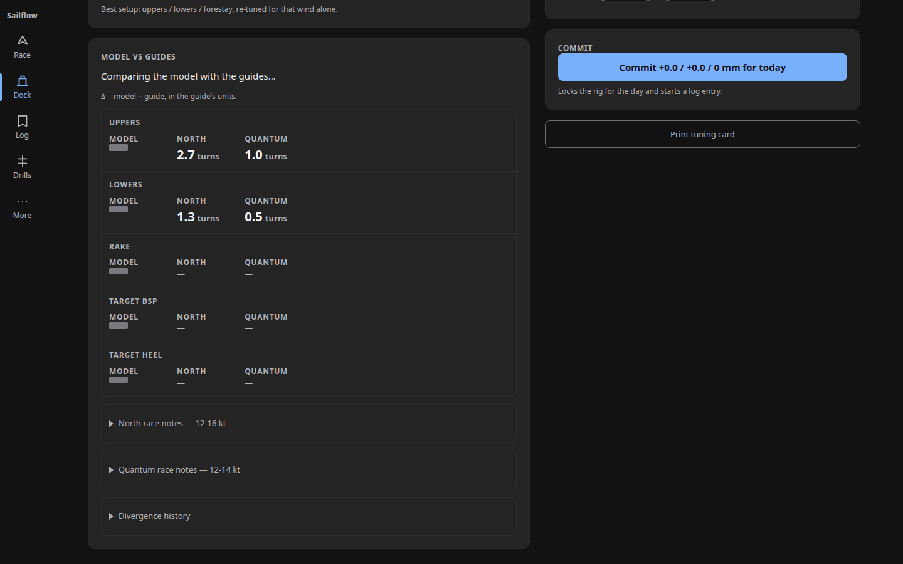

**Impact.** CLAUDE.md's honesty rule — "When the model and a tuning guide
disagree, show both and the delta — never resolve the disagreement silently in
favour of either" — is defeated on the primary desktop layout: the app states
that a disagreement exists and then withholds both numbers and the delta. ADR
0015 names the comparison surfaces as the point of the Analyse tier; this is the
main one.

**Principle.** Research §3 principle 3 (target and actual together) and 4 (one
screen, no scrolling); ADR 0015 "Analyse … comparison surfaces"; CLAUDE.md
honesty rules.

**Fix.** `overflow-y: auto` is a one-word patch that gives a 158 px window onto a
1257 px table and does nothing about the void, because the cause is a `
`
expanding into an `auto` grid row inside a `height: calc(100dvh - 56px)` grid.
The fix that holds is the second option: when the cockpit grid is active, render
the panel's summary row inline (Model / North / Quantum + Δ for the wind on
screen) and put the full table behind the existing `Sheet` on click.

**Effort.** S.

**Lenses.** expert.

### H-04 — After committing on the Dock, the Rig panel's gear chart renders a header row and no data

**Evidence.** Dock flow driven end to end at 1440×900, default Race tier:
*Suggest a setup* → *Commit +0.0 / +0.0 / 0 mm for today* → `#/race`. The Rig
panel then shows the North/Quantum segmented control, the base line, and the
`WIND UPPERS LOWERS FORESTAY` header with **zero of seven** data rows under it.
Measured `.p-rig .grid`: `scrollHeight` 667, `clientHeight` 121, 546 px hidden,
`overflow-y: auto`, and `offsetWidth − clientWidth = 0` — an overlay scroller
with no gutter, no scrollbar, no fade.

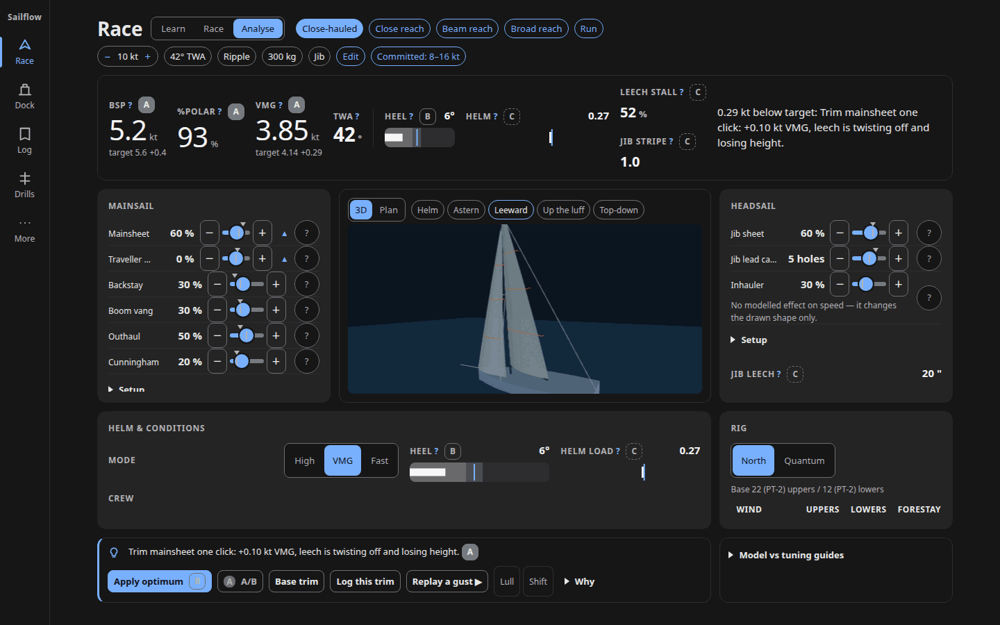

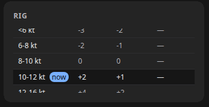

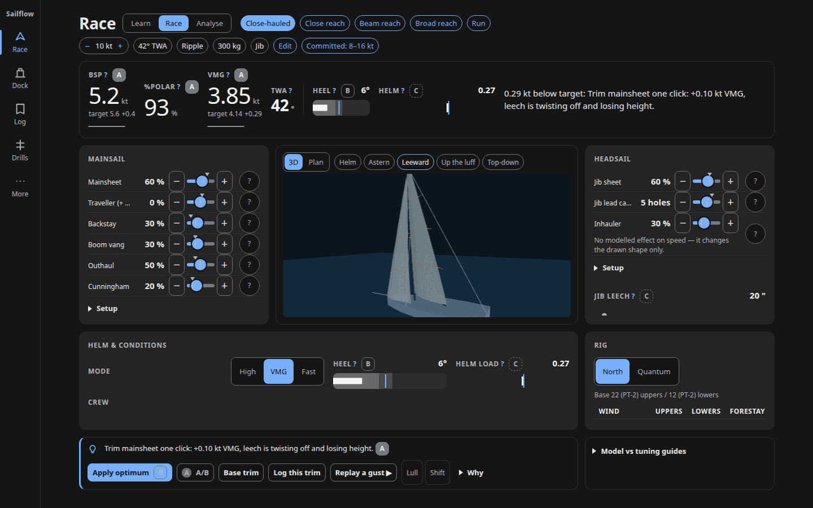

The refuter's numbers are worse than the lens's: at 1920×1080 the committed Rig
panel hides 482 px (2 of 7 rows visible), not the 229 the lens quoted. Three
corrections that do not change the verdict. (1) The lens's pre-commit figures
were mislabelled — before commit at the Race tier, Mainsail and Headsail hide
0 px; the 192/205/188 figures it quoted are post-commit, so the sail-panel
clipping is a consequence of committing, not an always-on condition.
(2) It does **not** occur at 1280×720: `Race.svelte:557-563` drops to
`height: auto` below 800 px of viewport height and the page scrolls, so all seven
rows render. This is a ≥ 800 px-tall desktop defect. (3) Panel-internal scrolling
itself is an accepted decision
(`phase-06-phone-restyle-audit.md:140-143`), so the general "add a scroll
affordance" half of the fix argues against a documented trade-off; the
header-over-zero-rows degenerate case is what carries High.

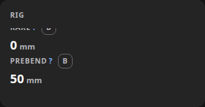

**Impact.** The gear chart with your row lit is what this panel exists for, and
committing the rig is the flow the app pushes you into with a banner and a
`#/dock` CTA. A table header over nothing reads as "no data for this guide", not
"scroll me". Same clipping hides the Mainsail leech-stall bullet, BATTEN, DRAFT ½,
the jib-leech stripe gauge and HEADSTAY SAG at the most common laptop viewport.

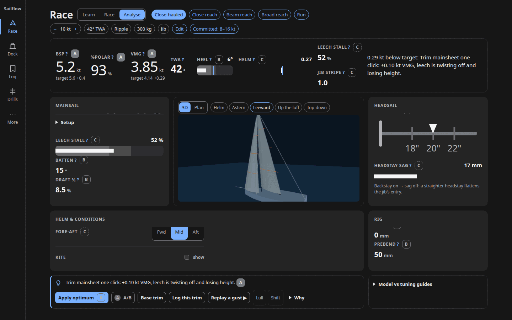

**Principle.** Research §3 principle 4 (one screen, no scrolling — honoured for
the page, broken inside the panel) and principle 3 (the lit `now` row is the
guide's target, and it is the row that never renders); ADR 0015 "Desktop is a
single screen with no scroll at 1280 px and wider".

**Fix.** Give the Rig panel a taller grid row — it currently shares
`minmax(150px, 0.55fr)` with Helm at `Race.svelte:543` — and, cheaper, render
only the lit row plus its neighbours in the cockpit (`rowFor` at
`src/ui/race/panels/Rig.svelte:14,40` already computes the index) with the full
table behind the existing `Sheet`.

**Effort.** M.

**Lenses.** expert.

### H-05 — Puff replay's power cue is one step behind, so at the peak of the gust it tells you to power up

**Evidence.** Polled the Gust sequence at ~120 ms through a full run at 1440×900,
sampling 1.1 s into each step. TWS goes 10 → 8 → 10 → 12 → 14 → 12 → 10 and is
correctly restored at the end. Steps / cue / HEEL / HELM:

| step | cue | HEEL | HELM |
|------|-----|------|------|
| 8 kt | Underpowered | 4° | 0.11 |
| 10 kt | Underpowered | 6° | 0.27 |
| 12 kt | Underpowered | 9° | 0.55 |
| **14 kt, on** | **Underpowered: weight up, point, trim.** | **15°** | **1.16** |
| 12 kt, easing | Overpowered: ease, point, trim. | 9° | 0.55 |
| 10 kt, settled | Underpowered | 6° | 0.27 |

At the peak the correct state is *over*: `heelBands(14)` gives hi = 14.67° and
heel reads 15°, with helm load 1.16 against a target of 0.30 on the same screen,
while the coach line says "Trim mainsheet one click: +0.06 kt VMG". The `lit`
panel order follows the same stale state — helm-first at 14 kt, mainsail-first
only as the gust leaves.

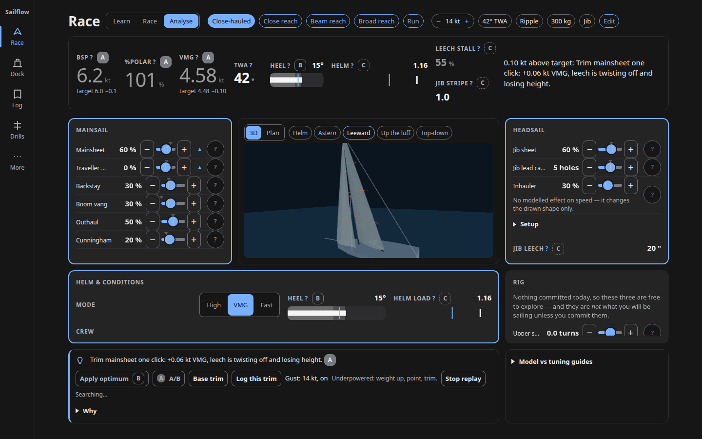

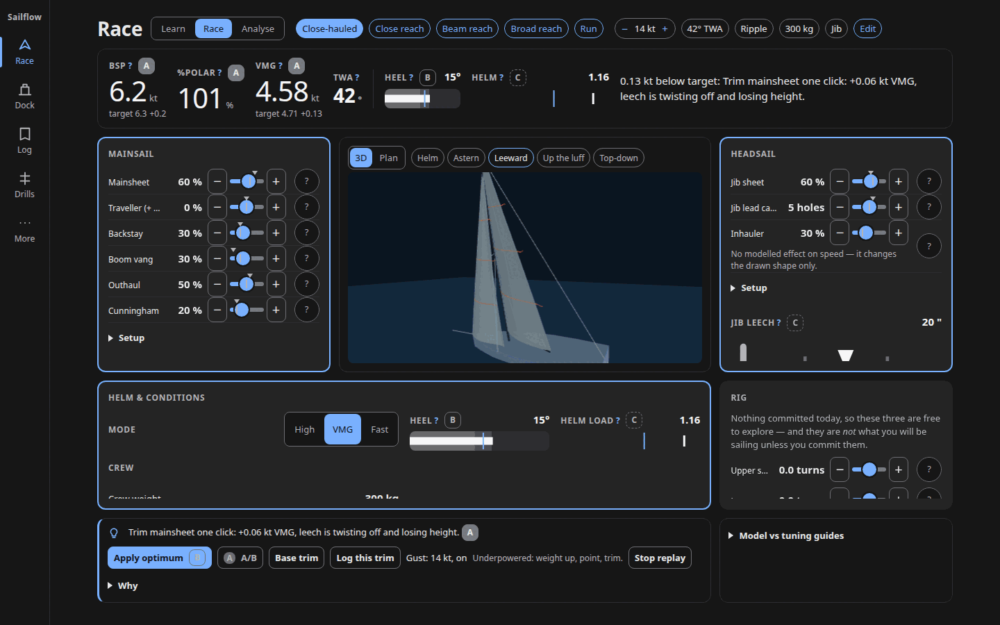

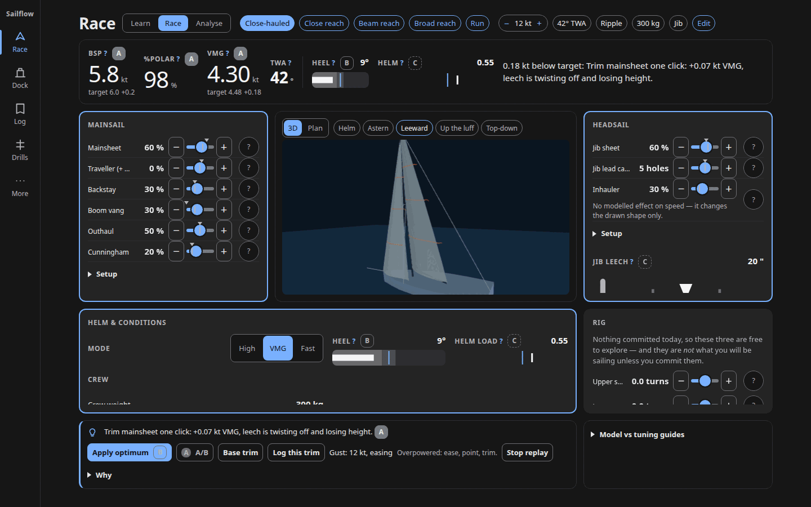

Cause: `src/ui/race/puffPlayer.svelte.ts:99-110` reads `race.result` — the
previous step's solve — immediately after writing the new condition, so
`powerState` (`src/ui/race/puff.ts:106-111`) is called with the **new** step's
`twsKt` and the **old** solve's `heelDeg`/`flat`. The displayed state is a mix of
two conditions, neither the boat you are on nor the boat the puff makes; the
in-code "a sailor has the same information, so it is honest" defence does not
survive that. One evidence correction: 14° is the 16.5 kt anchor, not the 14 kt
band top (14.67°).

**Known.** `docs/plans/2026-08-25-cockpit/phase-05-helm-rig-actions.md` lists
this under "Not done / for the next phase" and names phase 06 as the place to fix
it. It ships user-visible, so it is a finding.

**Impact.** The sequence never once says "overpowered" while the gust is on, and
says it only as the gust leaves. The replay teaches the reverse of the lesson it
exists to teach — ease, hike, trim through a puff — at the exact moment it
matters, while two visible gauges contradict it. For an expert this is the
fastest way to lose trust in the coach layer.

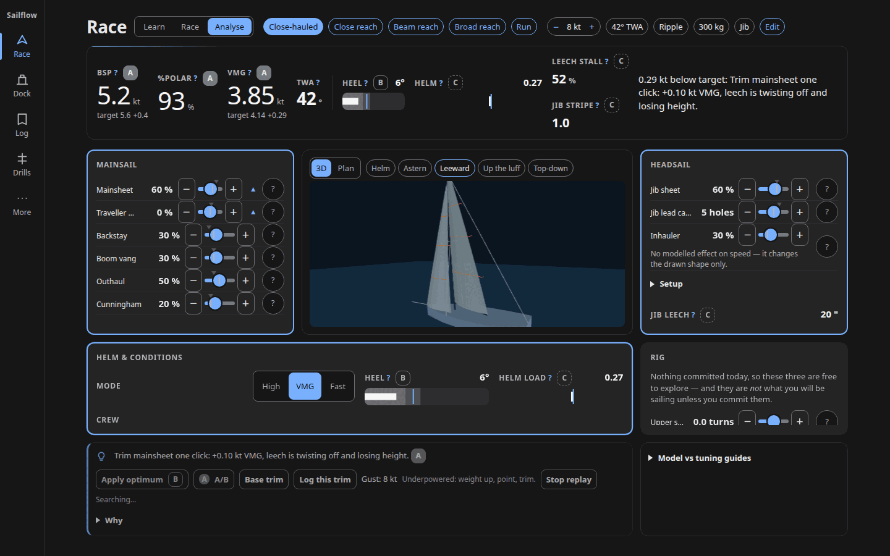

**Principle.** Research §3 principle 14 (prefer state over data — the state has
to be the right one) and 7 (feedback under ~100 ms).

**Fix.** Await the solve rather than the optimum before computing `power` and
`lit`. `#playStep` already has a poll loop in `#next` (`WAIT_MS` 200,
`MAX_WAIT_MS` 3000) — move the `powerState`/`panelOrder` assignment into that
loop's exit, keyed on `race.result` having caught up with the step's condition.
Until then, blank the cue on the first frame of each step rather than printing
the stale one.

**Effort.** S.

**Lenses.** expert.

### M-01 — Cockpit panels hide 54–81 % of their content behind an internal scroll with no signal

**Evidence.** Measured `scrollHeight / clientHeight` at 1440×900. Learn: Mainsail
464/213, Headsail 548/213, Helm & Conditions 309/124, Rig 415/80. Race: 464/295,
477/295, 310/135, 415/135. `document.documentElement.scrollHeight` is 900, equal
to `innerHeight`, so the page itself cannot scroll. Learn is tighter than Race
because the Learn cue paragraph eats the budget; Rig shows 19 % of its content
with the shroud and headstay sliders below the fold.

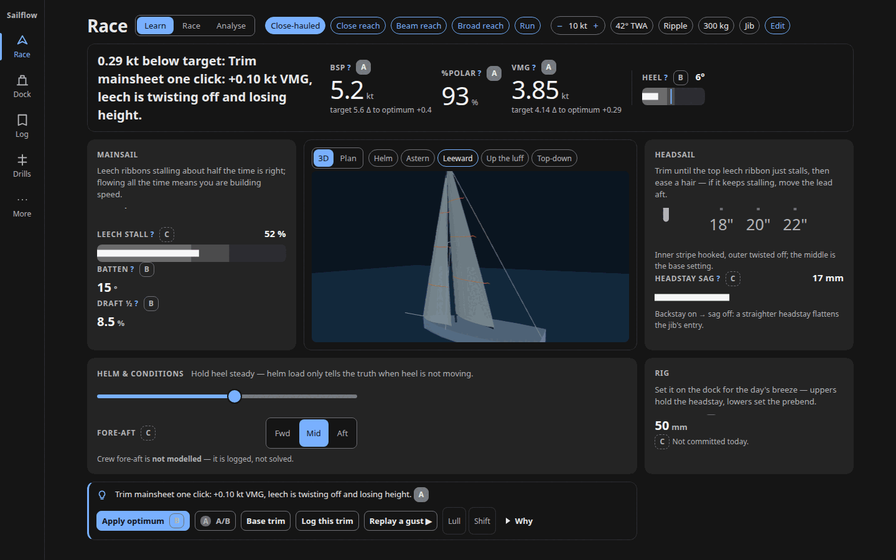

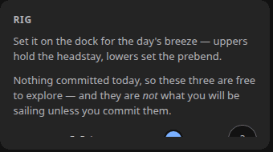

The panel column measures 336 px with `grid-template-columns: 303.5px`, so
`Panel.svelte:123`'s `@container (min-width: 560px)` three-column layout never
fires and the panel stays a single scrolling stack. The scroller is created at
`Race.svelte:641-649` inside the `@media (min-width: 1280px)` block.

Two sub-claims were disproven and are why this is Medium rather than High.
(1) "The controls can never be on screen with their own cue" is false: inside
Mainsail the controls occupy content offsets 0–266 and the LEECH STALL cell
282–338 in a 213 px window, so any `scrollTop` in roughly [89, 282] shows both —
at 135 the panel renders the Boom vang, Outhaul, Cunningham and Main halyard
sliders together with "LEECH STALL 52 %". Only the Mainsheet slider (0–36) is
never co-visible with the cue.

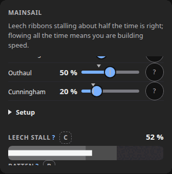

(2) The "no affordance at all" evidence is a headless artefact: a synthetic
`overflow: auto` div in the same Chromium build also reports 0 scrollbar width,
so desktop Chrome does paint one. Three of four panels also clip a row or a
sentence mid-height, which is the standard implicit more-below cue. `grep -rn
scrollbar src/` still returns nothing, so there is no styled scrollbar and no
scroll shadow.

**Impact.** Friction, one wheel gesture to recover, desktop-only — at 390×844
every panel grid is `overflow-y: visible` and nothing is hidden. The residue is
real: the Rig panel showing a fifth of itself, and Learn — the tier for the user
least able to guess what is below — being tighter than Race.

**Principle.** Research §3 principles 1 and 2 (group and keep channels
separable, rather than time-multiplexing them) and §2D (Few's "exceeding one
screen" traded for hiding content). Counterweight, and the reason this is a
trade-off rather than a mistake: `phase-06-phone-restyle-audit.md:140` chose
panel scrolling over per-tier hiding precisely to keep research §3 principle 19
(fixed widget positions) intact.

**Fix.** Lower `Panel.svelte`'s 560 px container threshold, or widen the panel
column, so controls | visual | instruments sit in the three columns the plan's
layout diagram shows. Short of that, promote each panel's one feedback cue out
of the scroll box into a pinned footer row, and add a scroll shadow so the hidden
remainder is signalled.

**Effort.** M.

**Lenses.** novice.

### M-02 — A drill shows "Finding the optimum…" indefinitely while it is actually waiting for the user

**Evidence.** `src/ui/drills/DrillView.svelte:51-60` deliberately withholds
`targets` until the first Check ("Before the first Check the answer key stays
hidden"), and `src/ui/race/verdict.ts:61` returns the *loading* copy
`'Finding the optimum…'` for any undefined target. It is not a slow solve and it
is not transient: read at 12 s after opening the day's drill, again after moving
a free slider and letting the live solve settle 2.5 s, still the same string.
Only pressing Check changes it, to "0.17 kt below target."

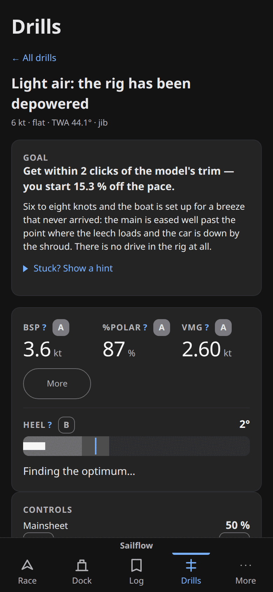

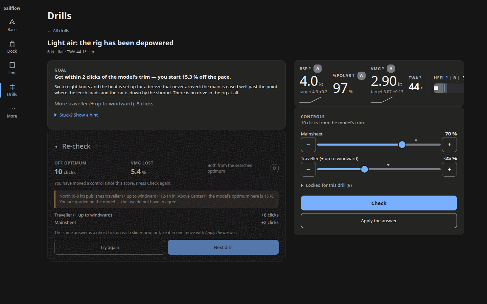

The desktop half of the original evidence belongs to [H-02](#h-02), not here: at
the default Race tier the string is clipped clean off the card (measured x 1519,
width 0), and the Learn-tier overprint is the same clipping defect. On the phone,
where the band lays out correctly, the copy is plainly visible and plainly wrong.

**Impact.** A novice reads a progress message and waits for something that is
waiting for them. Bounded, which is why it is Medium: the drill screen leads with
a loud GOAL block, the brief, a hint disclosure and a full-width primary *Check*
button directly below the misleading line, so the CTA sits in the same glance.

**Principle.** Research §3 principle 14 (prefer state over data — say what the
state is) and 24 (state what will happen before you commit).

**Fix.** Give `verdict()` a distinct branch for "target deliberately withheld"
and have `DrillView` pass copy that names the state: "Trim, then press Check —
the target stays hidden until you do." Two lines plus a case in `verdict.test.ts`
beside the existing line-66 assertion.

**Effort.** S.

**Lenses.** novice.

### M-03 — "Clicks" is the unit the coaching speaks in and it is defined nowhere

**Evidence.** Race prints "Trim mainsheet one click: +0.10 kt VMG"
(`src/ui/explain.ts:95-96`) beside a slider reading 60 %. Drills grades entirely
in clicks: goal "Get within 2 clicks of the model's trim", hint "More traveller
(+ up to windward): 8 clicks", score "OFF OPTIMUM 9 clicks", live caption "9
clicks from the model's trim" (`src/ui/drills/DrillView.svelte:45,239`,
`src/ui/drills/ScoreSheet.svelte:31-37`, `src/lib/drills.ts:464,494-497`). A
click is one `spec.step` (`drills.ts:464`) and is named nowhere in the UI; the
only place the app names the increment calls it "one step"
(`src/ui/keys.ts:95-96`). Every slider is labelled in %, holes or turns.

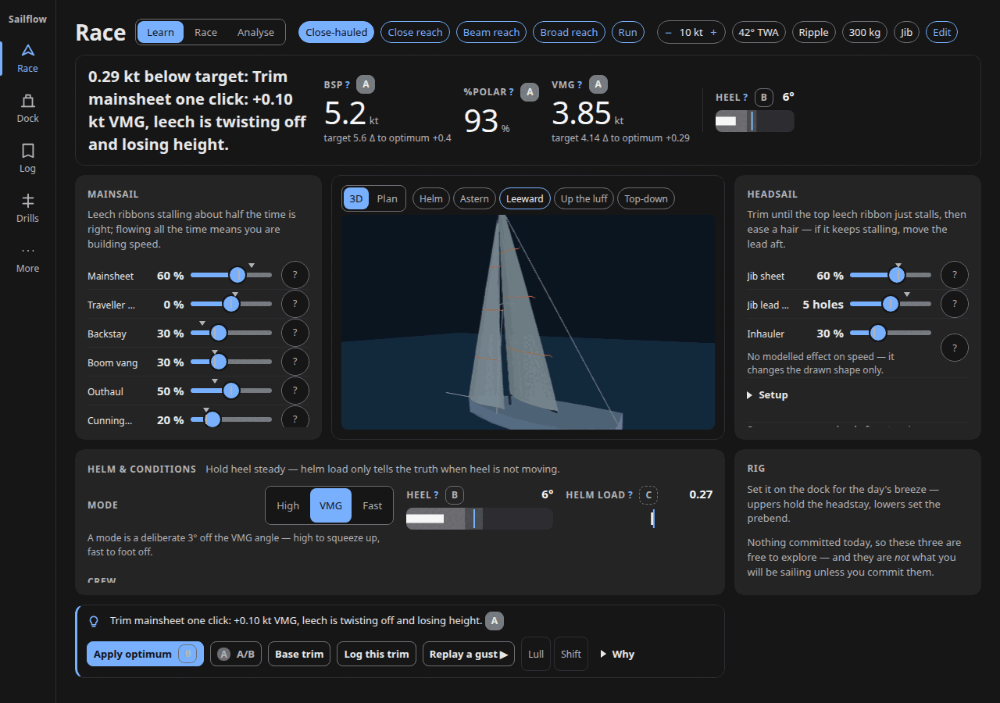

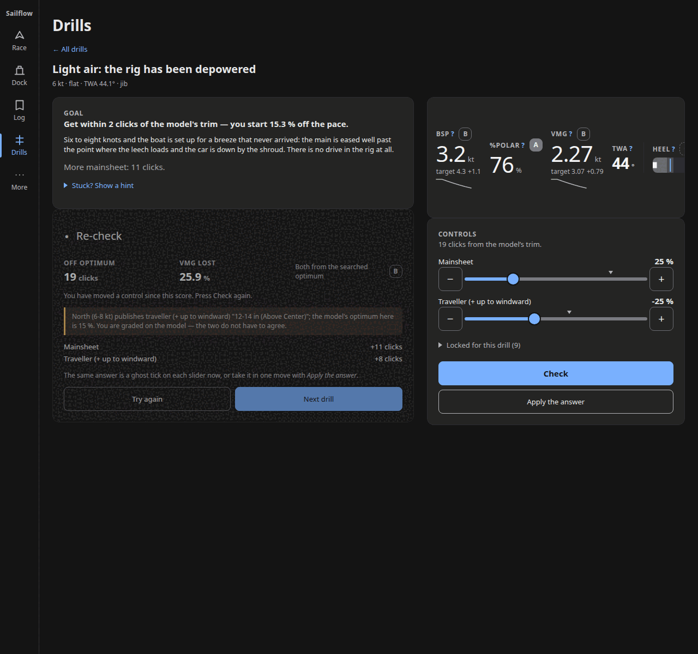

Extra support the lens missed: the Learn tier hides the ± steppers
(`src/ui/components/Slider.svelte:373-378`), which are the only discrete click
affordance in the product.

The refuter disproved two sub-claims. "Only actionable unit" is false — three of
four Race moves already speak in boat units ("More backstay", "Traveller up one",
"Lead car forward one hole", `explain.ts:88-105`). "Shown on nothing" is false —
every trimmed Race slider carries an optimum ghost tick and states the
destination in its own unit in `aria-valuetext` ("60 %, base trim 60 %, optimum
75 %"; `ControlRow.svelte:48-53`, `logic.ts:74-92`), and Drills shows the same
ticks plus *Apply the answer* after Check.

**Known.** Same substance as ux-02 [M-15](../2026-08-25-ux-02/todo.md), still
unticked at P2. Re-reported because this audit adds the Learn-tier stepper
suppression, and because the novice lens rates it the highest-leverage copy
defect in the app.

**Impact.** A units incoherence rather than a broken instruction: the reader can
reach the target from the ghost tick, but the sentence telling them to move
cannot be executed as written, and the drill's pass bar ("within 2 clicks") is
unreadable.

**Principle.** Research §2A (raw data converted into a decision-shaped unit —
"backstay: 14" is useless) and §3 principle 15.

**Fix.** Until M-15's purchase-derived units land, add one sentence to the
mainsheet `?` sheet: "one click = one arrow-key step, 5 % of the range". Do
**not** print the coach line as "Trim mainsheet 5 % (60 → 65)": the coach line is
a ±1-step gradient probe, not the distance to the answer — mainsheet optimum here
is 75 %, three steps away — so that phrasing would print a non-target.

**Effort.** M.

**Lenses.** novice.

### M-04 — The Learn tier ellipsises the control names it is specified to spell out

**Evidence.** Measured at 1440×900, Learn: seven labels truncated — "Traveller
(+ up to windward)" 157 → 76 px, "Upper shroud turns (from base)" 179 → 57,
"Lower shroud turns (from base)" 178 → 57, "Forestay length adjustment" 155 → 76,
"Main halyard fine-tune" 128 → 76, "Jib halyard fine-tune" 113 → 76, "Jib lead
car position" 110 → 71. On screen the novice reads "Traveller (+ …", "Jib lead
ca…", "Upper s…", "Lower s…". Rule at
`src/ui/race/panels/ControlRow.svelte:135-137`.

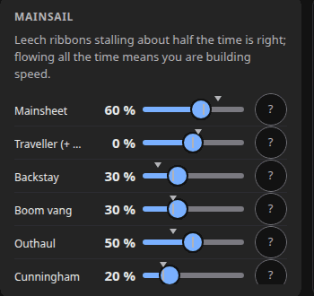

Deliberate per `phase-06-phone-restyle-audit.md` ("label ellipsised — the full
name is still the range's accessible name"), but the sighted novice gets no
tooltip and the full name exists only in the accessibility tree. The tier saves
nothing on control surface either: 15 visible ranges in all three tiers, with
visible focusable elements 106 / 140 / 144 for Learn / Race / Analyse — the
saving is entirely in readouts.

**Impact.** The tier that exists to teach hides the names of the things being
taught, and the hint text refers to them by full name ("More traveller (+ up to
windward): 8 clicks"), so hint and slider do not visibly match.

**Principle.** Research §4 pattern 5, which defines Learn as "one visual, one
number, one plain-language verdict, **control names spelled out**"; §3 principle
20. ADR 0015's revisit trigger is "audit ux-03 finds novices fail the Learn
tier", and this is a Learn-tier-specific regression of its own spec.

**Fix.** Scope the ellipsis to `[data-tier='race'], [data-tier='analyse']` and
let the label wrap to two lines in Learn. Learn can afford the height because it
already shows fewer readouts.

**Effort.** S.

**Lenses.** novice.

### M-05 — The Δ sign convention lives only in a source comment

**Evidence.** The instrument band reads BSP 5.2 kt, "target 5.6 Δ to optimum
+0.4", with the verdict "0.29 kt below target" in the same slab. The convention
is stated at `src/ui/race/InstrumentBar.svelte:47` ("+ means the target is faster
than you") and nowhere in the UI; `InstrumentCell` prints only "Δ to optimum"
(`src/ui/components/InstrumentCell.svelte:68-69`), and the BSP `?` sheet
(`src/ui/explain.ts:54-70`) explains BSP but not the delta.

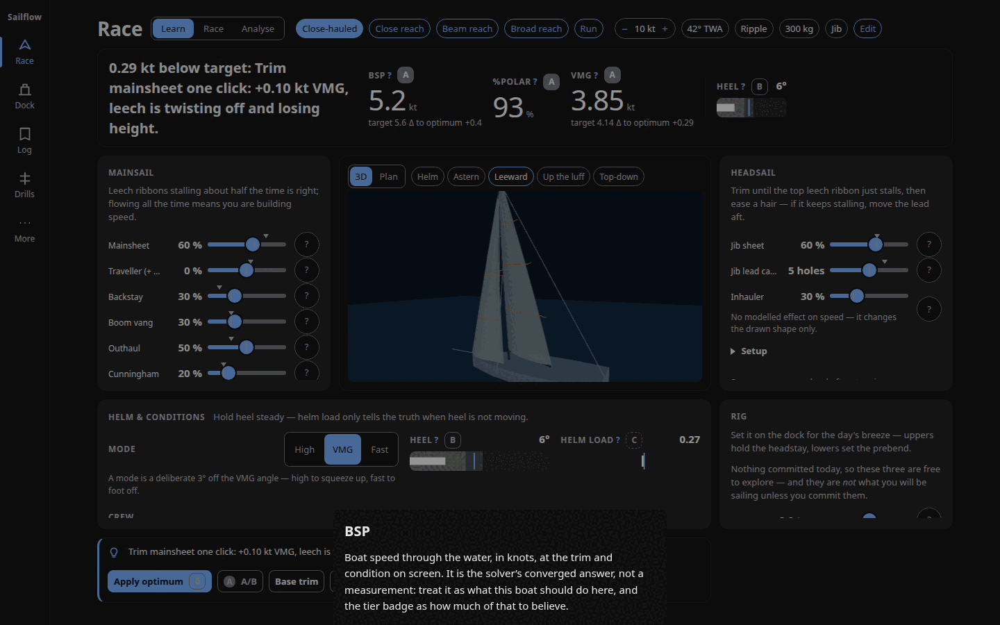

**Impact.** A beginner reads a leading `+` as good news while the sentence beside
it says they are slow. The label names the reference but not the direction, which
is half of what principle 15 asks for.

**Principle.** Research §3 principle 15 (always label what a delta is measured
against) and §2A (in a decision-shaped unit).

**Fix.** Either flip to the loss reading ("−0.4 to optimum") or extend the label
once per band to "Δ to optimum (+ = optimum is faster)", and add the sentence to
the BSP and VMG explainer sheets. See also [M-12](#m-12), which is the same
convention hidden from the tier least able to fall back on prose.

**Effort.** S.

**Lenses.** novice.

### M-06 — Race's only statement of what the screen is for is hidden on desktop, and nothing points a novice to Drills

**Evidence.** The phone renders the lede "Trim for the wind in front of you, and
see what the move is worth."; at ≥ 1280 px `src/ui/screens/Race.svelte:578-580`
sets `.lede { display: none }` and the desktop screen opens with no purpose
statement at all. A body-text scan of the desktop Race screen finds exactly one
occurrence of "drill" — the nav-rail item. There is no in-content handoff from
Race to Drills at either viewport.

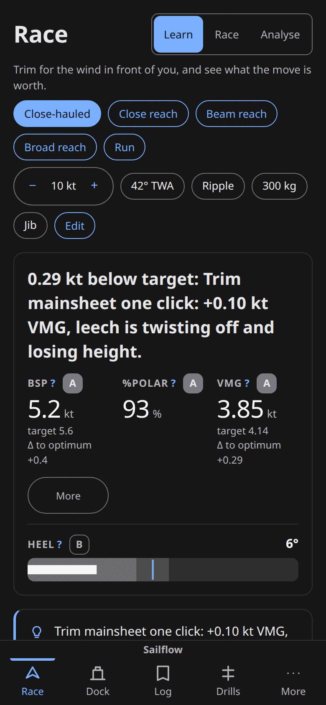

Hiding the lede is a documented phase-06 decision ("*The lede is hidden at
≥1280*, not shortened again"), taken on layout grounds; the missing handoff is
not, and partially regresses ux-02 M-01, whose remediation was the Race lede plus
three in-content handoffs.

**Impact.** Desktop is the default and Learn is the tier for someone who has
never sailed this: they land on the densest screen in the product with nothing
telling them what it does or where the guided path is.

**Principle.** Research §3 principle 18 (progressive disclosure is required, not
optional, for a trainer) and §2B ("the sim is the evidence, not the lesson").

**Fix.** Keep the lede on desktop as a single line in the header row — it is 62
characters and the header row has slack at 1440 — and add one "New to this? Try a
drill →" link into the actions strip.

**Effort.** S.

**Lenses.** novice.

### M-07 — The Analyse tier adds two duplicate readouts and a chevron

**Evidence.** DOM diff of visible `.cell` / `.gauge` / `.chev` / `.trend` nodes
between `sailflow.mode='race'` and `'analyse'` at 1920×1080 after six solves.
Only-in-Analyse: a `LEECH STALL` cell, a `JIB STRIPE` cell, the `▲` chevrons, and
— once an A/B baseline exists — the named diff line "A/B differs on Backstay,
Mainsheet, Traveller (+ up to windward), Outhaul, Jib lead car position."
Only-in-Race: nothing. Cells 32 → 34.

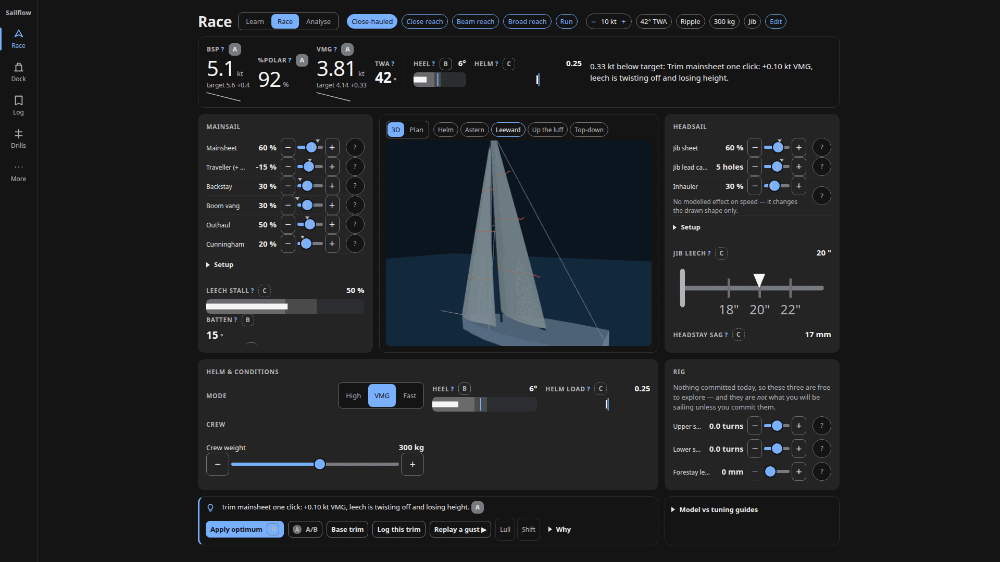

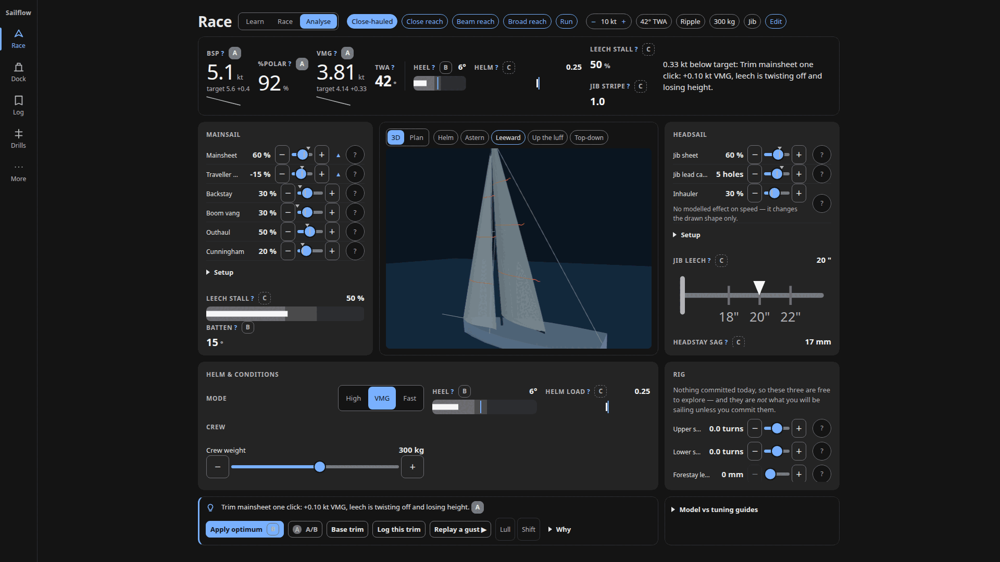

Both added cells duplicate channels already on the same unscrolled screen:
"LEECH STALL ? C 52 %" appears at y 83 in the bar and again at y 561 as a banded
bullet gauge in the Mainsail panel (`src/ui/race/panels/Mainsail.svelte:76`);
"JIB STRIPE ? C 1.0" at y 154 is the same channel as "JIB LEECH ? C 20″" at y 489
(`src/ui/race/panels/Headsail.svelte:92`), printed in a different unit.
`src/ui/stores/settings.svelte.ts:10` says so in the source: "analyse  race plus
the comparison surfaces (nothing extra yet)".

The refuter corrected the "no-op" framing on three counts. The A/B diff line is
genuinely new content and the lens's DOM diff missed it for want of an A/B
baseline; the chevrons carry direction plus the gain in kt
(`ControlRow.svelte:56`), which no other tier shows; and the quoted "bullet
graphs and sparklines for every channel, plus A/B" is research §4 Pattern 5, not
§3. The finding's strongest evidence is one it did not use: the sparkline half of
Pattern 5 is provably dead CSS —
`src/ui/components/InstrumentCell.svelte:176`'s
`:global([data-tier='analyse']) .cell.sm .trend { display: block }` can never
fire, because `trend` is passed by exactly two call sites app-wide
(`InstrumentBar.svelte:113` and `:133`) and both are `size="lg"`.

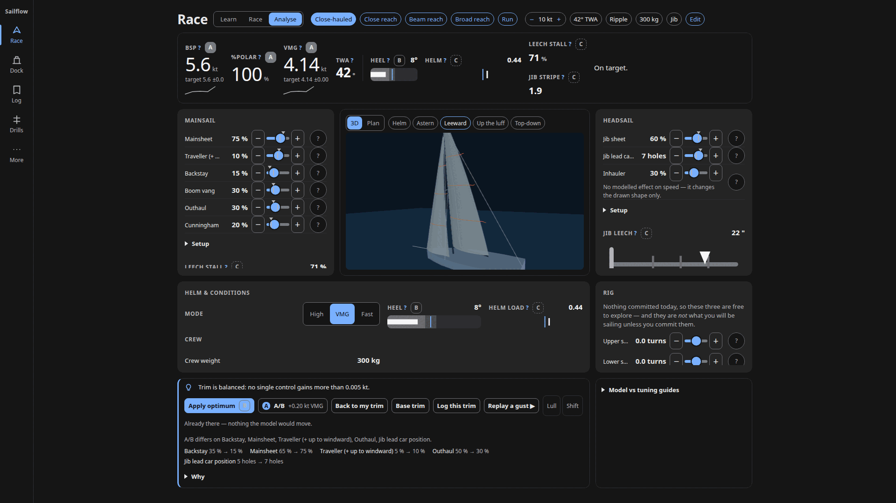

**Impact.** A third tier costs a toggle, a persisted key and a `data-tier`
contract across every panel, and returns two repeated numbers, two arrows and one
sentence. Nothing is wrong and the two copies agree, so this is redundancy and a
thin tier rather than a defect — but the two things it adds are the same channel
printed twice on one screen in two different units, which is the noise the
cockpit was meant to remove. Partly known: the plan's cut order lists the Analyse
tier last (`README.md:59-60`).

**Principle.** Research §3 principle 18 (progressive disclosure), §4 Pattern 5;
ADR 0015 density tiers.

**Fix.** Either land the promised content — sparkline plus labelled delta on
%POLAR, HEEL, LEECH STALL and JIB STRIPE, the A/B before→after list expanded by
default, the gear chart's current row promoted out of the Rig scroller — or
delete the tier and fold its two cells into Race. Do not ship a third tier whose
only unique numbers are duplicates.

**Effort.** L.

**Lenses.** expert.

### M-08 — Eight of the ten instrument cells carry no target bug and no trend

**Evidence.** Enumerated the live DOM at 1920×1080 in Analyse. Cells with a
`.target` block: BSP ("target 5.6 Δ +0.4") and VMG ("target 4.14 Δ +0.29") only.
Without: %POLAR, TWA, LEECH STALL, JIB STRIPE, BATTEN, DRAFT ½, RAKE, PREBEND.
Gauges: HEEL and HELM carry a bug; LEECH STALL, JIB LEECH and HEADSTAY SAG do
not — HEADSTAY SAG draws one bar rect and zero band rects.

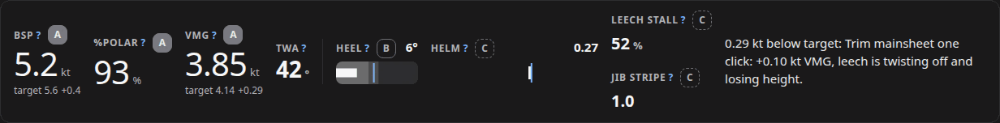

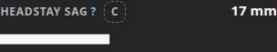

Root cause is cheap: `src/ui/screens/Race.svelte:91-99` derives `optimumTargets`
as `{bsKt, vmgKt, heelDeg}` from a full `SolveResult` that also carries
`instruments.pctPolar`, `leechStallFrac`, `jibLeechStripe`, `shape` and `rig`.
Seven channels are on hand and three are forwarded.
`src/core/solve/instruments.ts:233` computes a `pctPolar` band that the UI drops,
and `src/ui/instruments/gauges.ts:169` exports a unit-tested `pctOfTarget` with
no production caller.

The refuter cut the framing back hard, and the corrections are load-bearing for
severity. ADR 0015's Decision says "**optional** target bug, **optional** trend";
the "Aviation and marine practice never show a bare number" line sits in *Options
considered*, arguing for the cell over a raw value — and all ten numbers do go
through the cell with label, unit, tier badge and a `?` sheet. Two of the four
proposed targets already ship one panel away on the same screen: LEECH STALL
against the 50–70 % band is the Mainsail gauge
(`src/ui/race/panels/Mainsail.svelte:75-84`, four band rects in the DOM), and JIB
STRIPE against the 20″ middle stripe is the Headsail gauge
(`src/ui/race/SpreaderStripeGauge.svelte:69-78`, three labelled ticks, marker on
20″). TWA is a user-set input, not a model output, so it has no target to pass;
RAKE and PREBEND are consequences of the committed rig and already sit beside the
gear chart's `now` row.

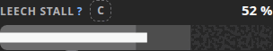

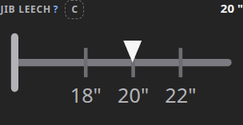

**Impact.** What survives is a genuine principle-3 violation on HEADSTAY SAG — a
zero-based filled bar reading 17 of 45 mm with no bands and no bug implies a
more-is-better ratio on a quantity whose good value the user cannot know — and,
more mildly, on %POLAR, whose confidence band the core already computes and the
UI discards. Missing context on secondary readouts; every value is correct,
labelled and explainable, and the verdict line states the primary gap in prose.

**Principle.** Research §3 principle 3 (show target and actual together, never
actual alone) and 20.

**Fix.** Forward the channels the solve already returns: `pctPolar` against 100
with the band `instruments.ts:233` computes, and HEADSTAY SAG against the
committed rig's sag with qualitative bands. Leave the bar's LEECH STALL and JIB
STRIPE alone or delete them (see [M-07](#m-07)) — the panel gauges beside them
already carry the reference.

**Effort.** M.

**Lenses.** expert.

### M-09 — Sparklines auto-scale to their own min/max, so slope carries no magnitude

**Evidence.** `src/ui/instruments/gauges.ts:197-208` normalises every series to
`lo = min(points)`, `span = max − min`, and stretches it across the full 16 px
height. Measured live after six trim solves at fixed conditions: BSP moved 5.2 →
5.1 kt and the rendered polyline is `0,0 21.33,5.39 42.67,10.73 64,16` — a
full-height fall across a 0.1 kt change.

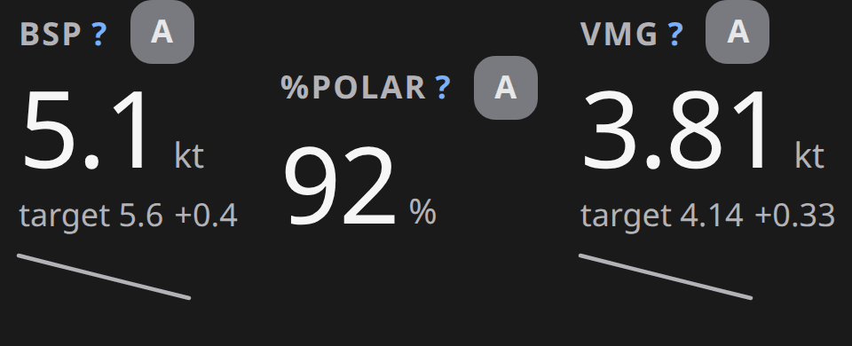

Only BSP and VMG get one at all; the `.cell.sm .trend` rule at
`InstrumentCell.svelte:176` is dead CSS (see [M-07](#m-07)).

**Impact.** Tufte's requirement is that a sparkline be quantified by adjacent
numbers; the only adjacent number here is the current value, so the line is
unreadable as magnitude and misleading as shape. An expert reading a steep fall
beside "5.1 kt" will believe the boat is dying when it moved a tenth.

**Principle.** Research §3 principle 20 (a separately labelled trend); source 37
(Tufte: sparklines scaled by adjacent numbers).

**Fix.** Floor the span in `sparkPoints` at a per-channel minimum (0.3 kt for
BSP/VMG) so a flat series draws flat, and add the optimum as a horizontal
reference line in the same 64×16 box — the cell already receives `target`, so it
is one extra `<line>` in `Sparkline.svelte`.

**Effort.** S.

**Lenses.** expert.

### M-10 — Any wind change wipes the trend buffer, so the sparkline is empty in the two flows an expert runs

**Evidence.** `src/ui/race/store.svelte.ts:55-57` keys history as
`${twsKt}|${twaDeg}|${sailset}` and `History.push` resets on a key change. Six
solves driven with the TWS `+` stepper (10 → 16 kt) leave `.trend svg` count at
**0** across the whole document; six solves at fixed conditions produce two
lines. The Gust replay steps TWS six times, so a replay also ends with an empty
buffer.

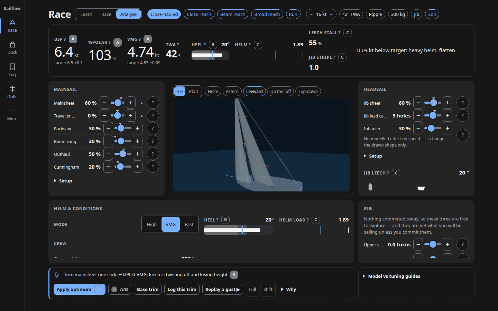

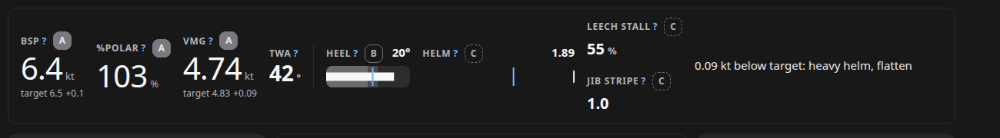

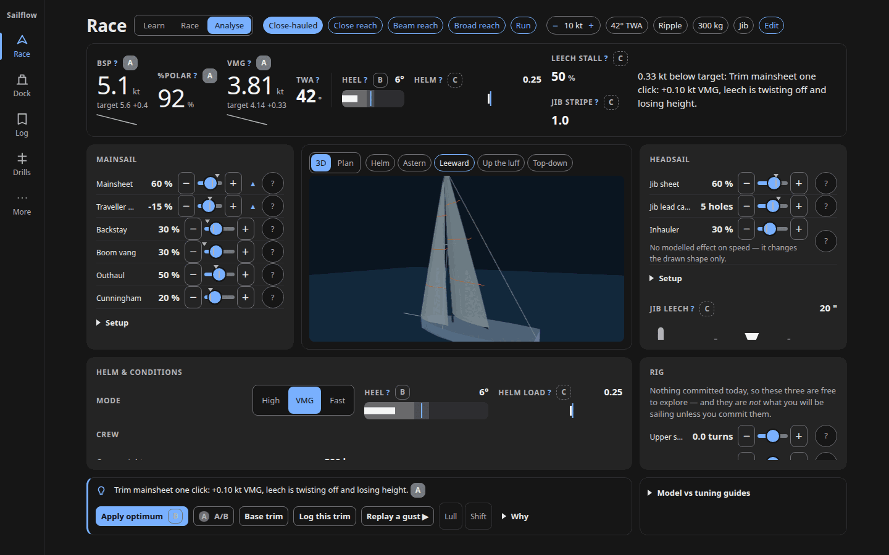

Separately, `store.svelte.ts:463-467` pushes `heel` into History on every
converged solve and `InstrumentBar.svelte:66` reads only `bs` and `vmg`, so the
heel series is collected and never drawn.

**Impact.** The reset is defensible per ADR 0015 ("a trend across a change of
conditions is two different boats"), but the consequence is that the trend line
is blank during the two flows a Grand Prix trimmer actually runs — sweeping wind
speed to build a gear chart, and watching a gust go through — and populated only
while grinding one control at a fixed 10 kt. Heel is the J/70's primary trim
gauge (research §2A) and its history is computed and thrown away.

**Principle.** Research §3 principle 20; §2A (heel is the actionable channel);
ADR 0015.

**Fix.** Keep the buffer across a condition change but mark the break: push a
`null` sentinel on key change and have `sparkPoints` split the polyline there, so
a wind sweep draws segments instead of nothing. Two lines in `History.push`, one
in `sparkPoints`. And render the heel series that is already collected — pass
`trend={history.series('heel')}` to the HEEL gauge.

**Effort.** S.

**Lenses.** expert.

### M-11 — Analyse's gradient chevron hides its magnitude in a native tooltip

**Evidence.** `src/ui/race/panels/ControlRow.svelte:87-90` renders
`▲`
and `:186-190` shows it only under `[data-tier='analyse']`. The visible glyph is
a 12 px accent triangle with no number, no unit and no label; the "how much"
lives only in the `title`. Only 2 of the 14 controls carried one in the runs
above.

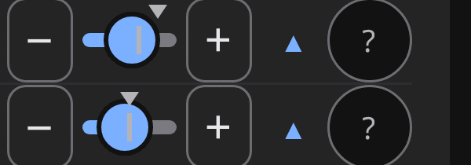

**Impact.** The gradient is the one genuinely new piece of information the
Analyse tier offers, and reading it costs a hover plus a ~500 ms tooltip delay
per control — which no touch or keyboard user can pay at all.

**Principle.** Research §3 principle 15 (label what every delta is against), 20,
and 29 (big text beats clever graphics).

**Fix.** Print the number beside the glyph in the Analyse tier — `▲ +0.06 kt` —
reusing the `chevLabel` string that is already computed, and drop the `title`. It
is a text node, not a new component.

**Effort.** S.

**Lenses.** expert.

### M-12 — The delta's reference is screen-reader-only outside the Learn tier

**Evidence.** `src/ui/components/InstrumentCell.svelte:139-159` absolutely
positions and clips `.delta-label` (the words "Δ to optimum") and un-clips it
only under `:global([data-tier='learn']) .delta-label`. In Analyse the expert
sees `target 4.14 +0.29` under VMG 3.85 with no statement that the delta is
optimum-minus-current. The convention then flips meaning with the side you are
on: at the 14 kt replay step the cell reads `target 4.48 −0.10` while the verdict
line 300 px away says "0.10 kt above target".

**Impact.** A delta without its reference is ambiguous, and a negative delta that
means "you are ahead" is the ambiguity the research names as endemic to
sim-racing overlays. Hiding the label in the tier whose users read fastest
inverts the intent: Learn has the coach sentence to fall back on, Analyse does
not. Same convention gap as [M-05](#m-05), one tier further along.

**Principle.** Research §3 principle 15, 20.

**Fix.** Show the `Δ to optimum` label at every tier — the cell already reserves
the flex row for it. If width is the objection at `sm`, abbreviate to `Δ opt`
rather than clipping, and make the sign convention match the verdict line's
wording (positive = you are short of target).

**Effort.** S.

**Lenses.** expert.

### L-01 — Every drill wears a "Due" chip on a first run

**Evidence.** Fresh context, Learn tier: all seven visible drill cards show a
"Due" chip above "Not attempted", including the three that are also the day's
featured drill. The chip is ux-02 M-17's resurfacing signal on the 1/3/7-day
schedule.

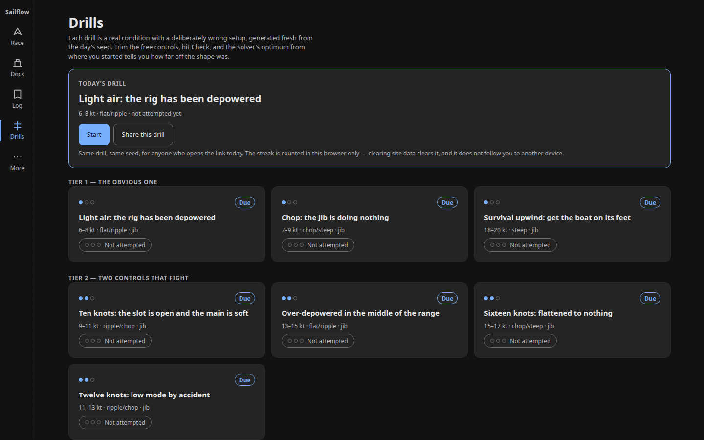

**Impact.** On the run where a novice most needs to be told where to start, the
one prioritisation signal on the page is uniformly on. "Not attempted" already
carries that state.

**Principle.** Research §3 principles 9 and 10 (keep the coded set small, encode
state so the states are distinguishable) and §2D (Few's "failing to highlight
what matters").

**Fix.** Suppress the Due chip when `attempts === 0`; reserve Due for the
resurfacing schedule.

**Effort.** S.

**Lenses.** novice.
