# Accessibility

Findings from the accessibility lens: nested interactives, focus order, status
messages, reduced motion, contrast and target size, at 1440×900 and 390×844 in
both themes and all three density tiers. Two findings here also carry another
lens's evidence and are noted as such.

### H-06 — The confidence badge is a button nested inside the "Apply optimum" button, so asking what "B" means rewrites the trim

**Evidence.** `src/ui/race/ActionsBar.svelte:52-64` renders `<ConfidenceBadge>`
— itself a `<button>` (`src/ui/components/ConfidenceBadge.svelte:34-46`) —
inside `<button class="apply">`. A DOM scan for `button button, button a, a
button, button input, button select` across all five routes returns exactly one
node on Race: `.badge tier-B` inside `.apply` (`nested-interactive`, serious).

Clicking the badge fires both handlers. Measured at 1440×900, `.apply` not
disabled: before, Mainsheet 60 / Traveller 0 / Backstay 30 / Outhaul 50 / Jib
lead 5; after one click on `button.apply button.badge`, 75 / 10 / 15 / 30 / 7 —
five controls rewritten — and the tier popover opened at the same time
(`aria-expanded: true`).

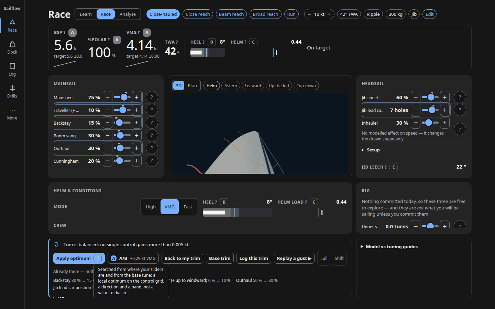

The badge is its own tab stop (#28 of the Race tab order) and a single Enter
reproduces it from the keyboard.

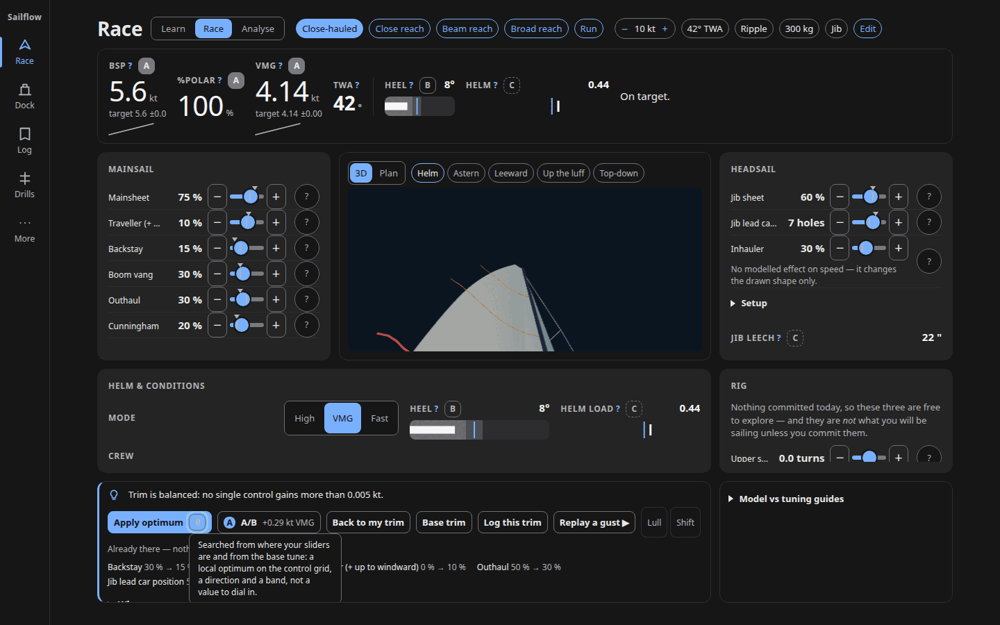

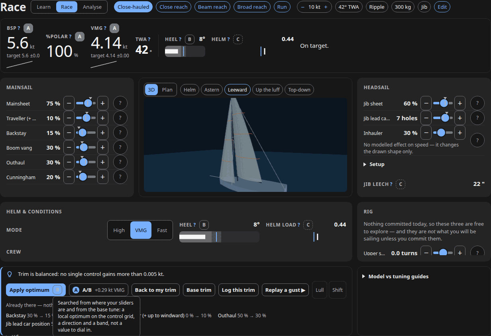

Two corrections from the refuter. The title's "six controls" is an overcount:
five sliders move. And the finding under-scopes itself —
`src/ui/dock/SuggestButton.svelte:43-49` has the identical nesting,
`<ConfidenceBadge>` inside `<button class="pick">`. It is latent in the default
Dock state (the list renders only once a suggestion exists) but reachable: after
*Suggest a setup*, three `button.pick button.badge` nodes appear, and clicking
one applied that rig setup (lower shroud turns 0 → −2). That is worse in kind,
because it silently changes a number the sailor then goes and physically turns on
the rig.

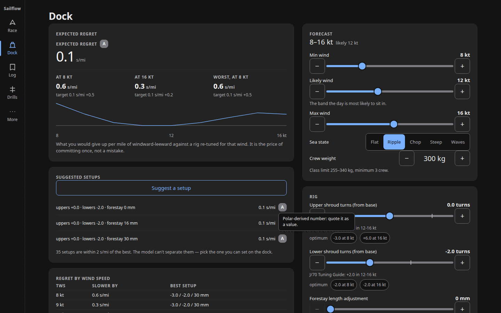

`axe-core` is not installed in this repo, so the lens's cited 4.10.2 run could
not be re-executed; the DOM scan above is the substitute and the violation is
mechanically certain either way.

**Impact.** A screen-reader or keyboard user who tabs onto the tier badge to find
out how much to trust the optimum applies it instead, discarding their trim. They
are told nothing that it happened — see [H-08](#h-08). It is also invalid HTML;
the nesting survives only because Svelte builds the DOM by API rather than by the
parser, so any SSR or hydration path would re-parent the badge. Recoverable
("Back to my trim" appears, `race.previousRace` is set), which is why this is
High and not Critical.

**Principle.** Research §3 principle 24 (preview the consequence of destructive
actions — this does the opposite); ADR 0015's one instrument-cell contract, which
puts a tier badge on every number, so the pattern is repeated by construction.

**Fix.** Fix it at the two call sites that wrap the badge in a button, not just
in `ActionsBar`: render the badge as a sibling in the actions row, or give
`ConfidenceBadge` an `interactive={false}` mode and expose the tier text through
the parent's `aria-describedby`. The A/B button's plain ``
(`ActionsBar.svelte:79`) is the precedent either way. A one-file change to
`ActionsBar` leaves `SuggestButton` broken.

**Effort.** S.

**Lenses.** accessibility.

### H-07 — Tab order leaves the instrument bar for the bottom actions strip, then jumps back up to the hero; no trim control is reachable until stop 41

**Evidence.** Playwright tab walk at 1440×900, dark, fresh context. Stops 1–25
are the rail, the density toggle, the conditions chips and the instrument-bar
cells (y 27–124). Stop 26 is a confidence badge at y 783. Stops 27–34 are Apply
optimum / Base trim / Log this trim / Replay a gust / Lull / Shift / Why at
y 815–859 — the bottom of the screen. Stops 35–40 jump back up to the hero camera
chips at y 213. The first Mainsail control is stop 41.

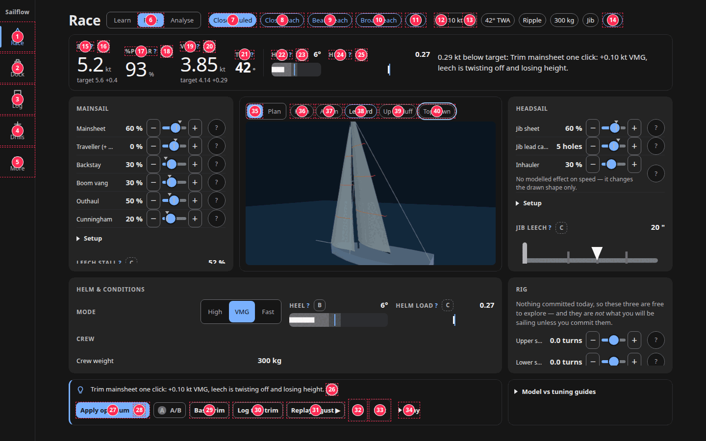

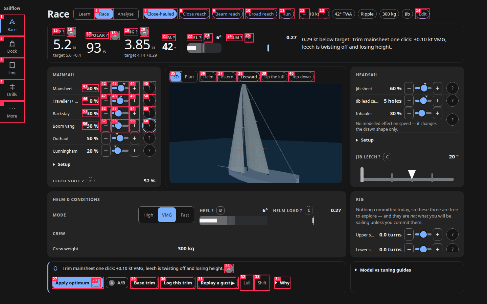

Cause is DOM-versus-grid order in `src/ui/screens/Race.svelte`:
`<section class="card insight">` (verdict + `<ActionsBar>`) is emitted at
`:259-320`, before `<SailHero>` (`:328`) and the four panels (`:334-339`), while
the CSS places it in the `act` row — bottom-left at the ≥ 1024 grid
(`:517-522`), the bottom band at ≥ 1280 (`:544-550`). Below 1024 px DOM order
matches visual order.

Two corrections. "A/B" is not a tab stop on first load — it is
`disabled={!race.previousRace}` (`ActionsBar.svelte:71`) — so stop 28 is the
Apply optimum badge. And at 1440×900 the focus ring is never lost: the cockpit is
height-capped, `scrollY` stays 0 across all 46 stops, so it is a visible 570 px
jump rather than a vanished indicator. The finding is *understated* at other
widths, which is why High holds: at 1280×760 the same walk scrolls the page to
`scrollY` 635 at stop 26 and back to 0 at stop 35; at 1024×900 it teleports the
viewport 0 → 1920 → 911 → 186 over stops 25/26, 34/35 and 40/41.

**Impact.** WCAG 2.2 SC 2.4.3 Focus Order. A keyboard user meets the three
whole-trim-rewriting buttons before any slider, then tabs past them again on
every pass, and on 1024–1280 px widths is thrown across three scroll positions
before reaching a control.
`docs/plans/2026-08-25-mvp-analyser/phase-09-desktop-and-visual-excellence.md:86`
lists "tab order sane" as a shipped goal, so this is not known-undone.

**Principle.** Research §3 principle 19 (keep widget positions fixed — focus
position is a widget position) and principle 1.

**Fix.** Move the whole `<section class="card insight">` block to after
`
` at `:339`. The grid areas keep the visual position
unchanged at ≥ 720 px. One caveat to check rather than assume: the coach verdict
lives inside the same section, so on the phone the move pushes it below all four
panels, where it currently sits under the instrument bar. The verdict is
separately derived into `InstrumentBar` (`:70`), so this is probably fine —
verify at 390 px.

**Effort.** S.

**Lenses.** accessibility.

### H-08 — Nothing on the Race screen is a live region: the verdict, the optimum apply and the point-of-sail change are all silent

**Evidence.** Measured at 1440×900 in a fresh context. At baseline, after
pressing `o` (apply optimum) and after pressing `3` (point of sail),
`document.querySelectorAll('[aria-live]:not([aria-live="off"]),[role=status],[role=alert],output')`
returns `[]` every time — while the coach line's text visibly changes from "Trim
mainsheet one click: +0.10 kt VMG, leech is twisting off and losing height." to
"Trim is balanced: no single control gains more than 0.005 kt."

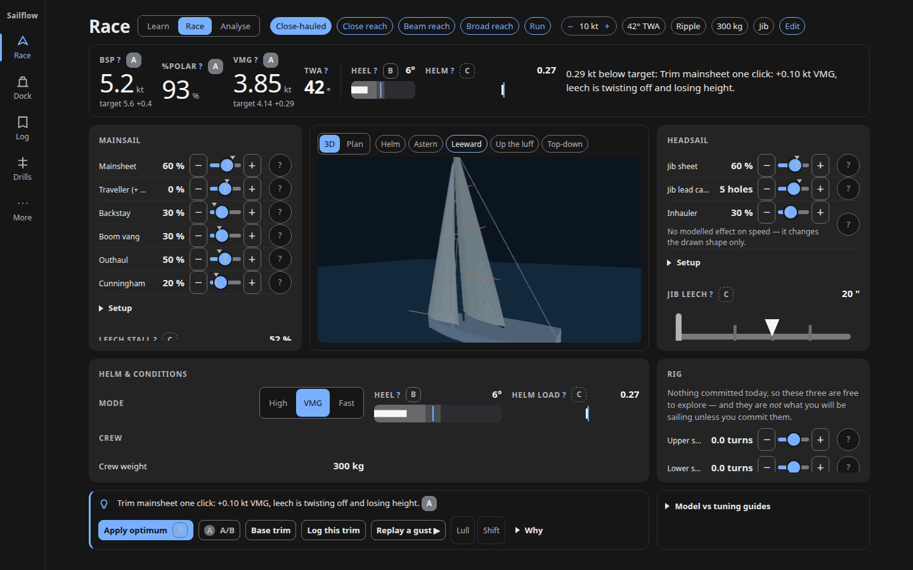

The coach line is a bare `
` (`src/ui/screens/Race.svelte:271`).
The only element in the Race DOM carrying `aria-live` is the instrument bar, with
the value `off` (`src/ui/race/InstrumentBar.svelte:101`). Grep across `src/ui`
finds live regions only at `PuffReplay.svelte:31`, `Toast.svelte:23`,
`ForecastCard.svelte:88` and four `role="alert"` error paragraphs. The escape
hatches are closed: `Race.svelte` does not import `Toast` (the app-level one at
`App.svelte:126` is hardcoded to the service-worker update), and `applyOptimum`
(`Race.svelte:103-121`) only mutates state and drives a tween.

Two technical over-statements that do not change the verdict: `aria-live="off"`
is the implicit default, so deleting it is a runtime no-op — it reads as an
intentional opt-out but suppresses nothing. And a keyboard user moving a slider
still hears that slider's own value; what is lost there is the re-solved
BSP/%POLAR/VMG. The `o` and `1`–`5` paths, which move focus nowhere, are fully
silent.

**Impact.** WCAG 2.2 SC 4.1.3 Status Messages. The app's entire product value is
the model's answer, and a screen-reader user gets no notification when it arrives
or changes — they must manually re-read the bar and the coach line after every
action. Combined with [H-06](#h-06), a user can apply the optimum by accident and
be told nothing at all.

**Principle.** Research §3 principle 14 (prefer state over data) and 3 (a screen
reader currently gets neither target nor actual on change).

**Fix.** Put `role="status"` on the coach `
` at `Race.svelte:271`
— it already carries the state-shaped sentence, so one attribute makes every
solve announce. Then add one visually-hidden `role="status"` summarising
BSP/%POLAR/VMG after a solve settles, so the individual cells do not chatter
mid-drag. `PuffReplay.svelte:31` is the pattern to copy.

**Effort.** M.

**Lenses.** accessibility.

### H-09 — `prefers-reduced-motion` never reaches the 3D hero, which renders at 60 fps continuously and tweens its camera presets

**Evidence.** `src/ui/three/SailView3D.svelte:214` is
`const still = $derived(freeze || settings.motion === 'off');`. `settings.motion`
defaults to `'system'` (`src/ui/stores/settings.svelte.ts:76`), and
`prefersReducedMotion` — imported by six other components — is never imported
here. `grep -rn matchMedia src/` returns only `min-width: 720px`,
`min-width: 1024px` and `pointer: coarse`: no JS anywhere evaluates the
reduced-motion query. Line `:547`'s
`goTo(preset, still || settings.motion === 'off')` is algebraically just `still`,
so the 600 ms preset tween runs whenever the telltales do.

A controlled A/B at 1440×900, identical page, `reducedMotion: 'reduce'` confirmed
inside the page, only the stored setting differing. Four canvas screenshots
400 ms apart, md5 of each PNG:

| `sailflow.motion` | frame hashes |
|---|---|
| unset (→ `'system'`) | d5500ea9, 3894d62c, 4e910ace, a07089c0 — four distinct frames |
| `'off'` | d5500ea9 ×4 — byte-identical across 1.2 s |

Frame 0 matches across both runs, so the scenes are identical at t = 0 and
diverge only because the `'system'` run keeps advancing `uTime`. That isolates
the cause to the `settings.motion === 'off'` test and rules out rendering
nondeterminism.

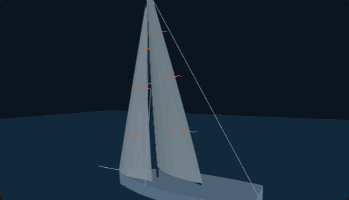

The performance lens measured the same defect from the other side by patching
`WebGL2RenderingContext.prototype.clear`: desktop 1440×900, Race idle, nothing
touched — 901 renders in 15.0 s = 60.0 fps at 15 draw calls per render, identical
with the context launched `reducedMotion: 'reduce'`, and 0 renders in 10 s with
`sailflow.motion = 'off'`. The `still` flag is the only brake and it never
consults the media query.

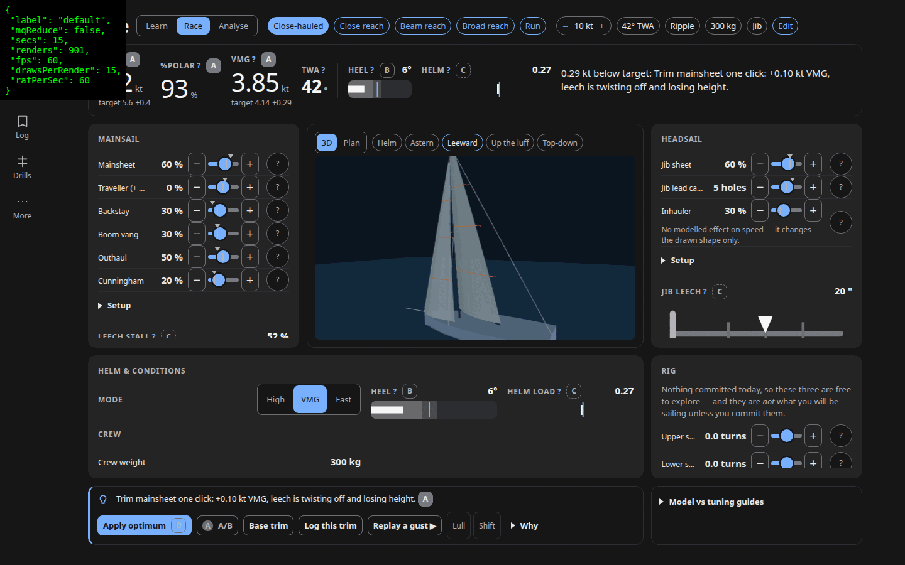

Two things make this worse than the lenses claimed, and one makes it milder.
Worse: `src/ui/screens/More.svelte:188` ships the sentence "System follows your
device's reduce-motion setting; the other two override it here", which is false
on the default setting; and
`docs/plans/2026-08-25-cockpit/phase-04-three-d-hero.md:16-17` ticks both
"frozen under reduced motion" and "presets … jump under reduced motion" as
delivered, so this is a falsely-closed item rather than a known-undone one. It
went unnoticed because `tests/ui/race-3d.spec.ts:26` and `tests/ui/race.spec.ts:22`
both `localStorage.setItem('sailflow.motion', 'off')`, forcing the one branch
that works. Milder: "forever" is bounded —
`SailView3D.svelte:509-519` pauses on tab-hide and on IntersectionObserver exit —
and on a 390×844 phone the Race landing screen mounts no WebGL at all (0 renders
in 10 s; the panel tabs default to Main). It takes one tap on the *3D* tab, after
which 60.0 fps is confirmed.

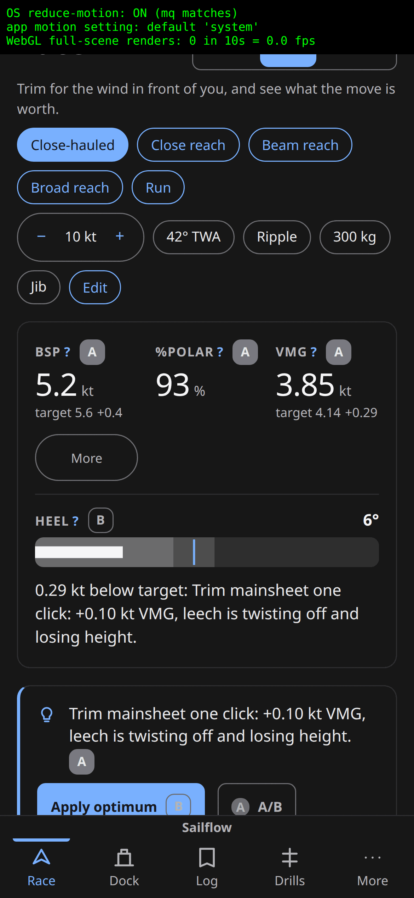

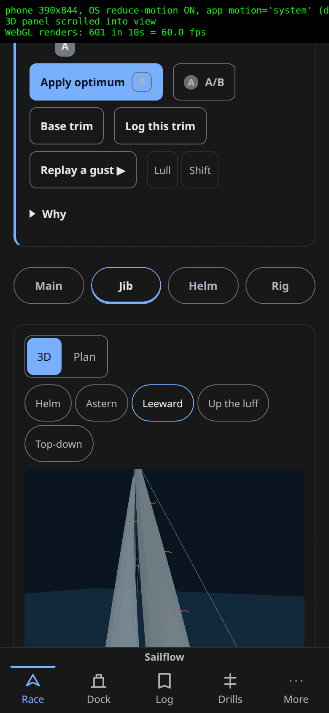

**Impact.** A vestibular-sensitive user who set the OS preference gets a
continuously animating sail and an orbiting camera, and is told by the More
screen that the default setting already honours their device. ADR 0014's
Consequences commit to "render on demand rather than a continuous loop,
`prefers-reduced-motion` freezes telltales and jump-cuts camera presets" — an
accepted, immutable ADR — and the plan ticks it as done. Secondarily, a laptop
parked on Race, the default route, burns a GPU and a rAF slot continuously.

The WCAG citation both lenses reached for is overstated and should not be quoted:
SC 2.3.3 Animation from Interactions is Level AAA and bites only on the camera
tween; the continuous telltales are closer to SC 2.2.2 Pause, Stop, Hide, which a
pause mechanism (More → Motion → off) arguably already satisfies. Report it as a
broken ADR commitment with an accessibility impact.

**Principle.** Research §3 principle 12 (honour `prefers-reduced-motion`, keep
gesture-coupled motion) and 13 (one rAF loop); ADR 0014 Consequences.

**Fix.** `import { prefersReducedMotion } from 'svelte/motion'` in
`SailView3D.svelte` and make `:214`
`freeze || settings.motion === 'off' || (settings.motion === 'system' && prefersReducedMotion.current)`,
then use that same `still` at `:547` instead of re-testing `settings.motion`. The
test is the load-bearing half, not an optional extra: assert the canvas is
byte-identical across two frames under reduced motion **with `sailflow.motion`
unset**, since pinning it to `'off'` is what hid this. Do not add the
telltale-frame rate limit the performance lens proposed — it trades visibly
choppier telltales, which are an instrument and not decoration, for an unmeasured
saving on a 15-draw-call scene, and is not what ADR 0014 asks for.

**Effort.** S.

**Lenses.** accessibility, performance.

### H-10 — Confidence badges fail text contrast in both themes: 1.06:1 on the Apply optimum button

**Evidence.** Computed-style sampling of every text node on Race against
composited effective backgrounds, both themes, all three tiers, disabled controls
excluded. `.apply` samples `disabled === false`, so no disabled exemption
applies.

| element | dark | light |
|---|---|---|
| tier-B badge inside `button.apply` | rgb(179,179,184) on rgb(122,176,255) = **1.06:1** | rgb(58,66,80) on rgb(0,87,217) = **1.62:1** |
| that badge's 1 px border | 2.29:1 | 1.37:1 |
| tier-A badge (BSP, %POLAR, VMG, coach line) | rgb(232,232,234) on `--muted` rgb(122,122,128) = **3.49:1** | rgb(11,18,32) on rgb(107,118,131) = **4.05:1** |

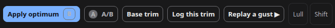

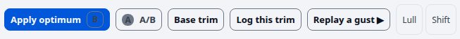

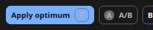

Cause: `src/ui/components/ConfidenceBadge.svelte:79-83` gives tier B
`background: transparent`, so it composites onto whatever it is dropped onto —
here `src/ui/race/ActionsBar.svelte:54-64`'s `background: var(--accent)` with
`OPTIMUM_TIER = 'B'` (`src/ui/race/optimum.svelte.ts:38`). `:75-78` paints tier A
on `--muted`, a token `src/ui/tokens.css:27` defines as "filled geometry that
must recede", at 12 px / 600 — not large text, so 4.5:1 is the floor. The border
figures also fail SC 1.4.11 for a control boundary.

`scripts/contrast_check.mjs:59-67` cannot catch either: it asserts `--ink-2` only
on `--bg`/`--surface`, asserts nothing but `--on-accent` on `--accent`, and lists
`--muted` only as a foreground at 3:1. There is no `--ink` on `--muted` row, and
a transparent badge composited onto a filled button is invisible to a
token-pair checker by construction.

**Impact.** WCAG 2.2 SC 1.4.3. The tier letter is the app's honesty contract
(CLAUDE.md: "every model output carries a confidence tier") and on the primary
button it is an unreadable smudge — the one place a user is about to accept a
model recommendation is where the caveat is least legible. The tier-A failure
alone would be Medium; the 1.06:1 case sets the ceiling.

**Principle.** Research §3 principle 8 (dark not black; 3:1 non-text per WCAG
1.4.11); ADR 0015 Consequences ("every non-text component meets 3:1 in both
themes").

**Fix.** Give the badge an explicit surface instead of inheriting: `background:
var(--surface)` plus `color: var(--ink)` on `.tier-B`/`.tier-C` so it never
composites onto a filled button, and repaint `.tier-A` on `--surface-2` with
`--ink` (7.4:1). Note the lens's alternative is wrong: `--bg` on `--muted`
measures 4.39:1 dark and still fails. Then add two rows to
`scripts/contrast_check.mjs` — `--ink` on `--muted` at 4.5:1, and the badge's
chosen pair on `--accent`.

**Effort.** S.

**Lenses.** accessibility.

### M-13 — Instrument-label "?" buttons are 17 px tall on the phone

**Evidence.** Measured at 390×844 with touch emulation, crediting `.hit-44`'s
pseudo-element: 13 `.explain` buttons, twelve at 17.4 px tall and one wrapped
pair at 34.8 px — BSP 34×17, %POLAR 65×17, VMG 39×17, HEEL 42×17 (twice), LEECH
STALL 92×17, BATTEN 60×17, DRAFT ½ 67×17, JIB LEECH 73×17, HEADSTAY SAG 105×17,
RAKE 43×17, PREBEND 70×17. None wears `.hit-44`.
`src/ui/components/InstrumentCell.svelte:45` and
`src/ui/components/BulletGauge.svelte:68` emit `class="explain"` only, and
`.explain { padding: 0; border: none }` (`InstrumentCell.svelte:86-95`,
`BulletGauge.svelte:143-152`) leaves the target as the bare text line-box, against
`--hit-min: 44px` at `src/ui/tokens.css:83`. Peers do carry it:
`ConditionsStrip.svelte:43,75,79`, `Slider.svelte:166`, `ControlRow.svelte:94`.

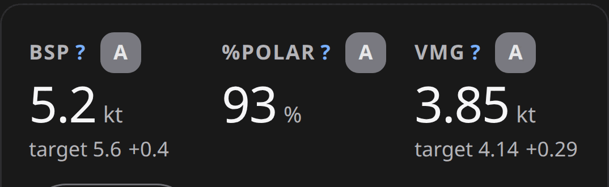

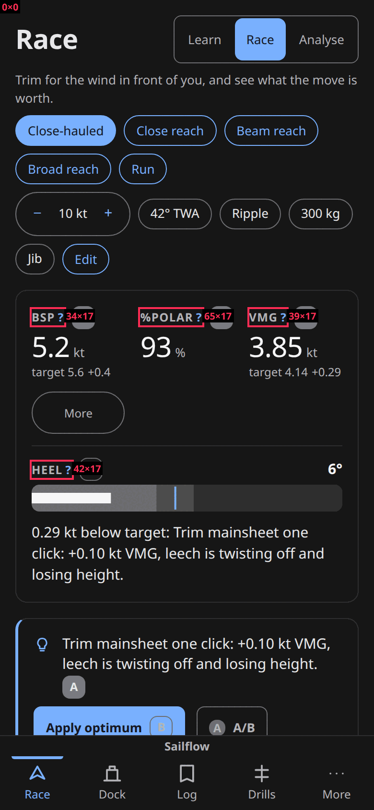

The refuter cut the WCAG claim back sharply, and it is why this is Medium. SC
2.5.8's exception is an undisturbed 24 px-diameter circle — centre-to-centre ≥ 24
px, not an 8 px edge gap. Measured nearest-target centre distances: BSP 36.9,
%POLAR 52.3, VMG 39.7, HEEL 40.9, LEECH STALL 30.0, BATTEN 38.8, DRAFT ½ 53.4,
HEADSTAY SAG 72.7, HELM LOAD 60.5, RAKE 41.6, PREBEND 55.0 — all clear. Only "Jib
leech?" at 23.1 px, against an adjacent step button, actually fails SC 2.5.8. The
19 `ConfidenceBadge` buttons at 24×24 pass outright (minimum neighbour distance
36.9) and are **not** an oversight:
`src/ui/components/ConfidenceBadge.svelte:56-59` carries an explicit rationale
tracing to ux-01 M-13 — "a 44 px overlay would swallow presses meant for the
readout beside it" — which the proposed one-class fix would recreate.

**Impact.** On a boat, in gloves, on a bouncing phone, the affordance that
explains every instrument is a 17 px strip, against the repo's own 44 px token.
One target fails AA outright; the rest are friction. Phase 06's height-budget
carve-out (`phase-06-phone-restyle-audit.md:104-110`) explicitly scopes the
shrink to `.cockpit` at ≥ 1280 px with a 28 px floor, so 17.4 px on a phone is
outside it and unjustified by any doc.

**Principle.** Research §3 principle 22 (pair every control with its why) and the
Fitts finding in §2D that target size drives error rate disproportionately; WCAG
2.2 SC 2.5.8 for the JIB LEECH case.

**Fix.** Add `.hit-44` to the `.explain` button in `InstrumentCell.svelte:45` and
`BulletGauge.svelte:68` only — the class already exists at `src/app.css:225` and
expands the hit area via `::after` without changing the paint. Leave
`ConfidenceBadge` at its documented 24 px. Constrain to `max-width: 719px` if the
desktop band must stay tight, and check the expanded bands do not overlap
adjacent targets in the ≥ 1280 cockpit, where rows are 37 px apart.

**Effort.** S.

**Lenses.** accessibility, phone.

### M-14 — The point-of-sail and conditions groups carry `aria-label` on role-less `
`s

**Evidence.** `src/ui/race/ConditionsStrip.svelte:39`
`
` and `:53`
`
`. `aria-label` is prohibited on
the implicit `generic` role and is dropped by browsers; confirmed in the CDP
accessibility tree at both 390 and 1440 px — neither name appears, and the five
chips are exposed as bare toggle buttons named "Close-hauled", "Close reach", …
with nothing saying what they select between.

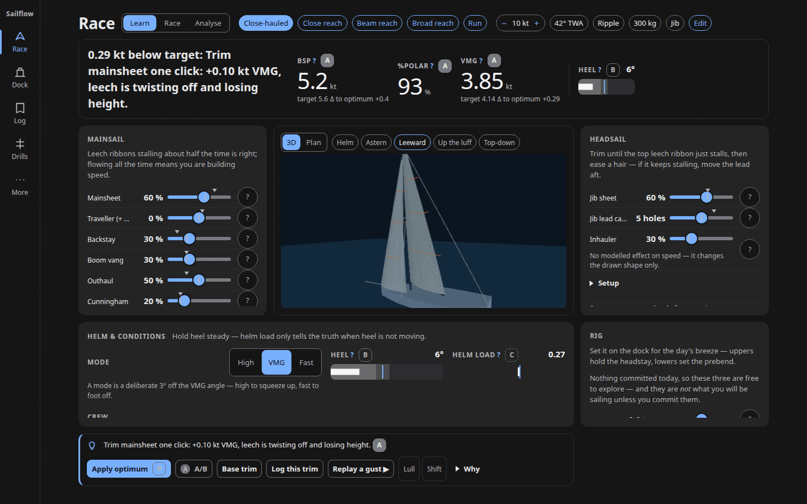

**Impact.** A screen-reader user arriving at tab stop 7 hears "Close-hauled,
toggle button, pressed" with no grouping context, and the same for the wind-speed
stepper, sea state and crew-weight chips that follow. `aria-pressed` and
`aria-busy` work correctly, so the only thing missing is the group name — which
the developer clearly intended to be there.

**Principle.** Research §3 principle 16 (name groups after the sailor's task) —
the names exist, they just never ship.

**Fix.** Add `role="group"` to both divs. One attribute each, and the existing
`aria-label` becomes valid and announced. `role="radiogroup"` would be better for
the point-of-sail row since exactly one is active, but that means switching the
chips from `aria-pressed` to `role=radio`/`aria-checked`, which
`Segmented.svelte:41-47` already models.

**Effort.** S.

**Lenses.** accessibility.

### L-02 — The puff-replay chips outline in `--line`, the one place phase 06's `--line-strong` sweep missed

**Evidence.** `src/ui/race/PuffReplay.svelte:80`
`border: 1px solid var(--line)`. Measured against the composited parent surface:
rgb(46,46,48) on rgb(26,26,26) = **1.28:1** dark; rgb(221,227,234) on
rgb(242,244,247) = **1.17:1** light. Identical in all three tiers, both themes.
Phase 06's progress log records converting exactly this pattern to
`--line-strong` in the Dock, Log, Drills, More and `NumberField` surfaces;
`PuffReplay` was not in that sweep, and `scripts/contrast_check.mjs` checks
token-to-surface pairs, not which token a component chose.

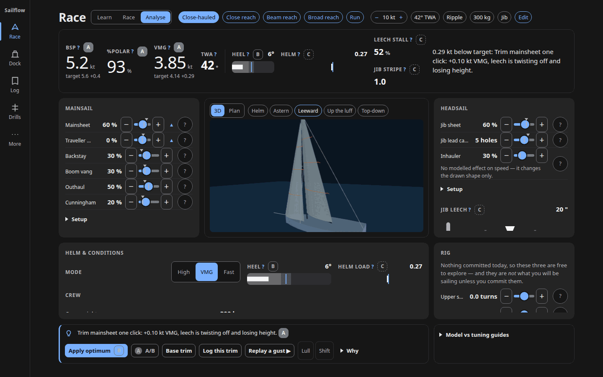

**Impact.** WCAG 2.2 SC 1.4.11 for the Lull and Shift buttons' boundary. Their
text labels are legible, so what fails is the affordance rather than the content
— in low light or on a sun-washed phone the two chips read as text, not buttons.
Against ADR 0015's commitment that every non-text component meets 3:1 in both
themes.

**Principle.** Research §3 principle 8; ADR 0015 Consequences.

**Fix.** `border: 1px solid var(--line-strong)` at `PuffReplay.svelte:80`,
matching `ConditionsStrip`'s chips and `Slider.svelte:358`'s `.step` buttons. No
token change: `--line-strong` is already gated at 3:1 on all three surfaces by
`scripts/contrast_check.mjs`.

**Effort.** S.

**Lenses.** accessibility.

### L-03 — The rig-elevation figure puts a `<button>` as a direct child of a `<dl>`

**Evidence.** `src/ui/race/RigElevation.svelte:147-161` — `<dl class="mono">`
holds three `
<dt>/<dd>
` groups and then
`<button type="button" class="chip hit-44" aria-pressed={dims}>dims</button>` as
a fourth direct child. Invalid content model for `<dl>`; flagged as
`definition-list` (serious, 1 node, `.mono`) at 390 and 1440 px in both themes.

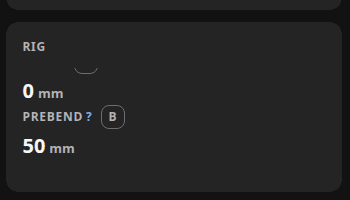

**Impact.** Screen readers that announce definition lists by item count get an
item that is not a term/definition pair, and some drop the button from list
traversal entirely, hiding the exaggeration toggle. Visually nothing is wrong,
which is why it survived.

**Principle.** Research §3 principle 20 (two-tier hierarchy per data cell — the
toggle is not a cell).

**Fix.** Move the `dims` button out of the `<dl>` into the surrounding `<figure>`
beside the `<figcaption>` at `:165`, or wrap the `<dl>` and the button in a flex
`
`. The paint is unchanged either way.

**Effort.** S.

**Lenses.** accessibility.
