# Phone

Findings at 390×844 and 360×740, the form factor the plan calls the primary one
("Phone (< 720 px): same panels stacked, hero first, sticky panel tabs"). The
17 px `?` targets found by both the phone and accessibility lenses are filed once,
as [M-13](02-accessibility.md#m-13).

### H-11 — The 3D hero is not first on the phone; it is 1045 px down, under a sticky strip that scrolls past it

**Evidence.** DOM order at `src/ui/screens/Race.svelte:238-339` is lede →
`ConditionsStrip` → `InstrumentBar` → insight card → `ActionsBar` →
`<PanelTabs />` (`:326`) → `.hero-boat` (`:328`) → the four panels. Below 720 px
the cockpit is a plain flex column (`:366-370`) with no `order` override — the
only `order:` rules in the file (`:679`, `:686`) reorder controls and visual
*inside* a panel.

Measured at 390×844: `.hero-boat` top 1045 px, canvas top 1216 px, panel strip
top 969 px (`position: sticky`, `top: 0`), viewport 844 px, document 5178 px =
6.1 screens. At 360×740: hero 1076, strip 1000, document 5219 = 7.1 screens. 3D
itself loads fine (canvas 332×257, zero console errors).

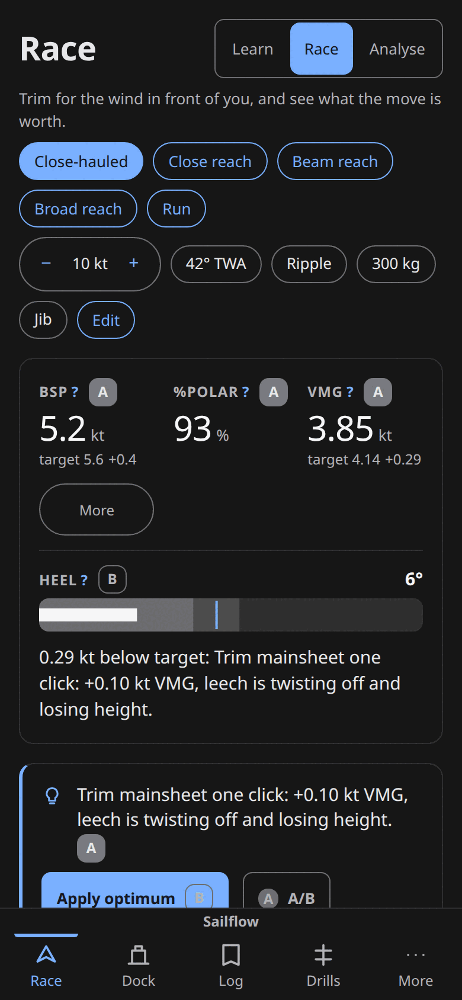

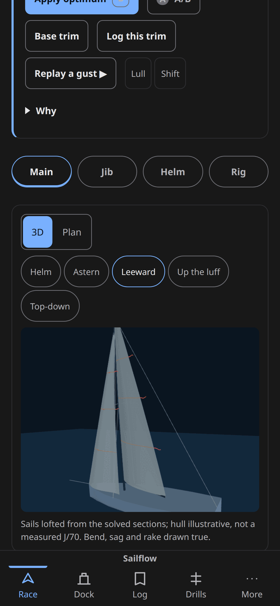

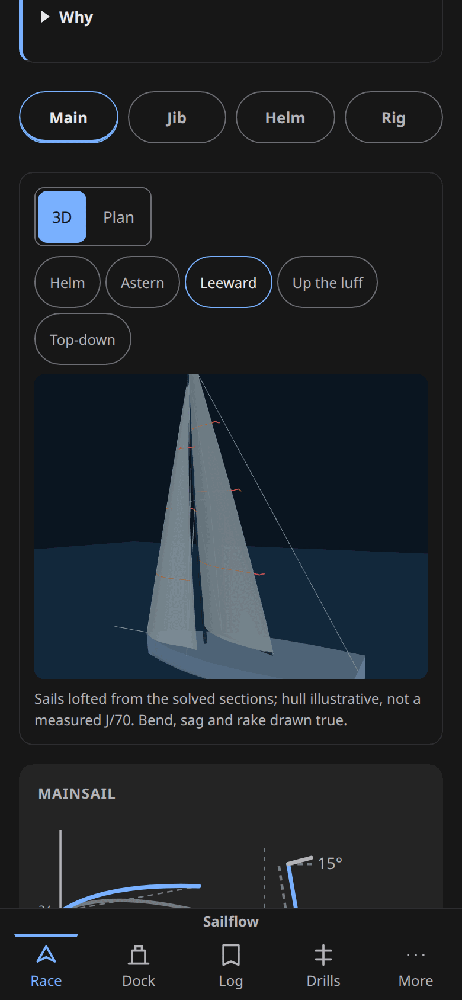

The navigation trap is reproduced, not asserted: from `scrollY` 0, tapping *Main*
lands at `scrollY` 1457 — past the hero — and the strip has no entry that returns
to it.

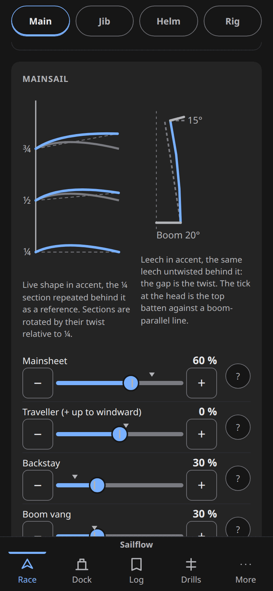

One sub-claim trimmed. `phase-06-phone-restyle-audit.md:113` reads "hero first at
about 4:3, under a sticky Main · Jib · Helm · Rig strip", which fairly describes
what shipped, so the ticked task at `:12` is only half-contradicted. The line
genuinely violated is the plan README's layout section: "Phone (< 720 px): same
panels stacked, **hero first**, sticky panel tabs". The source comment at
`Race.svelte:363-365` documents the shipped order as "…the coach and its actions,
the tab strip, the hero", so the deviation is recorded in code and not in the
plan.

**Impact.** A phone user scrolls 1.25 screens before seeing the cockpit's hero,
and the one navigation control on the screen moves them past it with no way back.
This is the primary screen at the primary form factor.

**Principle.** Research §3 principle 4 (one screen, no scrolling for the primary
cockpit) and 21 (a viewpoint control is part of the trim UI — unreachable from
the only phone nav); plan README "Phone (< 720 px) … hero first".

**Fix.** Move `<PanelTabs />` below the hero and hoist `.hero-boat` above
`.card.bar` under a `@media (max-width: 719px)` `order` rule. Both are flow
children of a flex column below 720 px, so `order:` works directly.

**Effort.** M.

**Lenses.** phone.

### M-15 — The bottom tab bar is squeezed into the iOS home-indicator zone

**Evidence.** `src/ui/components/BottomNav.svelte:44-48` sets
`.bottom-nav { height: 56px; padding-bottom: env(safe-area-inset-bottom) }`
under the global `* { box-sizing: border-box }` (`src/app.css:25-27`), so the
inset eats the content box instead of extending the bar.
`index.html:5` carries `viewport-fit=cover`, so `env()` resolves non-zero on
device and the bug is live rather than dormant.

Reproduced with a real inset via CDP `Emulation.setSafeAreaInsetsOverride`
(bottom 34), 390×844 at DPR 2:

| | inset 34 | inset 0 |
|---|---|---|
| `.bottom-nav` | 788 → 844, computed height 56 px (does **not** grow) | 788 → 844 |
| `.bottom-nav a` | 788 → 832, height 44 px (collapsed from 56) | 788 → 844 |
| label span | 813.3 → 830.7 — wholly inside the reserved 810–844 strip | — |
| `.commit-bar` (Dock) | 671.6 → 754, a 34 px gap to the nav | 705.6 → 788, flush |

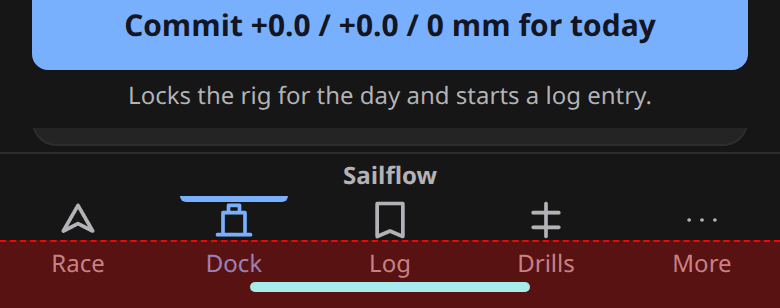

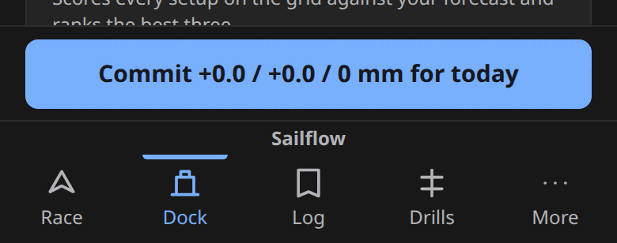

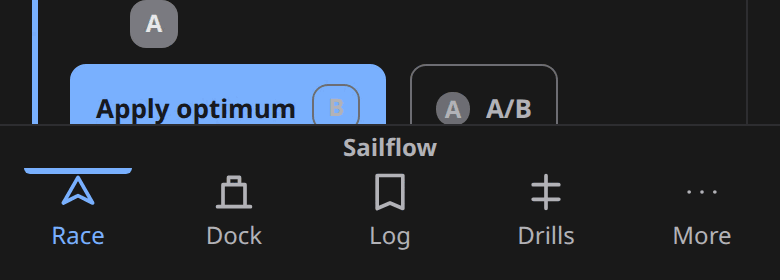

Three claims from the original finding were disproven, and they are why this is
Medium rather than High. iOS delivers taps in the home-indicator region to the
app — what the system reserves there is the swipe-up *gesture*, so the labels are
a HIG gesture-conflict risk, not swallowed taps. The label span bottom measures
830.7 against a drawn indicator at roughly 831–836, so the labels abut the
indicator rather than being drawn behind it. And tap targets are not degraded:
`min-height: var(--hit-min)` (44 px, `src/ui/tokens.css:83`) holds, and because
padding paints the background the nav's surface still covers to y 844 — no
floating bar, no gap.

`src/ui/screens/Dock.svelte:384` and `src/ui/components/Toast.svelte:39` are not
a second and third bug: `bottom: calc(56px + env(safe-area-inset-bottom))` is
exactly correct *for the nav's intended height*, and they are the only two call
sites written to the intended contract.

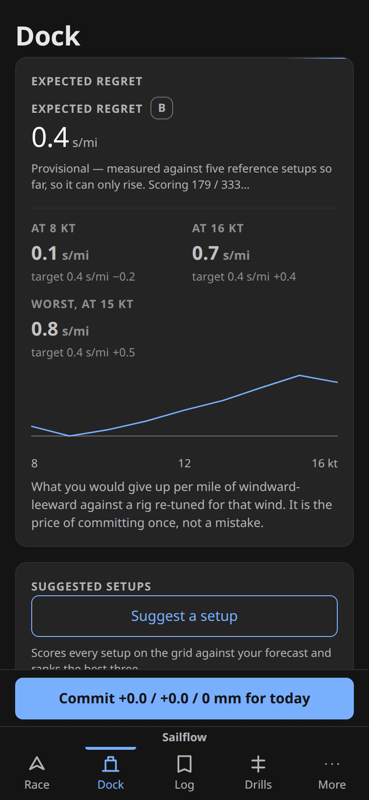

**Impact.** On notched phones the tab bar loses 34 px of intended height, all
five labels sit in the gesture-reserved strip, and Dock's commit bar floats 34 px
clear of the nav with scrolled card content showing through the gap.

**Principle.** Research §3 principle 19 (fixed widget positions) and 25 (integer
spacing module); Apple HIG's bottom-edge reservation.

**Fix.** One line in `BottomNav.svelte`: `height: calc(56px + env(safe-area-inset-bottom))`.
That leaves `Dock.svelte:384` and `Toast.svelte:39` correct as written. The
alternative — `min-height: 56px` — also works but then requires editing both of
those call sites.

**Effort.** S.

**Lenses.** phone.

### M-16 — The HELM gauge draws two hairlines on an invisible track

**Evidence.** `src/ui/race/InstrumentBar.svelte:169-181` renders
`<BulletGauge label="HELM" value=… min={-1.5} max={1.5} target={HELM_TARGET} symbol />`
with no `unit` and no `ranges`. With `ranges` undefined, `bulletScale` returns
`rangePcts: []` (`src/ui/instruments/gauges.ts:73-88`), the `{#each bands}` block
at `src/ui/components/BulletGauge.svelte:87-96` emits zero rects, and `.chart`
has no background fill (`:167-171`). Live DOM: HEEL svg = 4 rects + 1 line, HELM
svg = 0 rects + 2 lines, svg background `rgba(0,0,0,0)`.

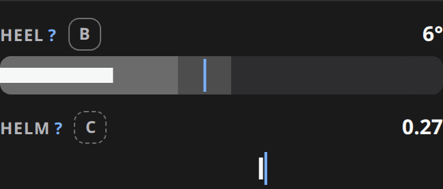

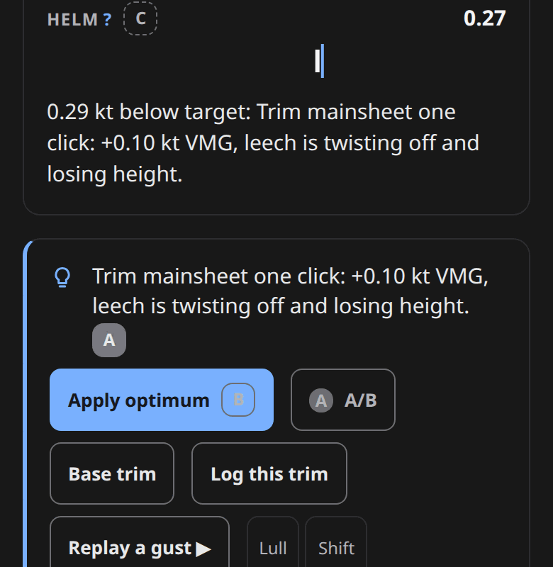

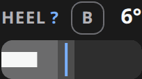

Three of the original supporting claims are wrong and are why this is Medium.
It is **not** phone-only: the same trackless gauge renders in the Helm panel
visual at 1440 px (`src/ui/race/panels/Helm.svelte:161-171`, label "HELM LOAD").

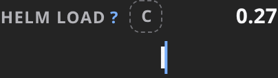

It is not "the exact bare number the ADR forbids": the cell does carry a target
bug (the blue line at x 59.0 against a value at 59.4) and a C tier badge; what it
lacks is the qualitative bands. And the two strokes are not ambiguous — they are
colour- and width-coded (value white `--instrument` at 3, bug blue `--accent` at
2), identically to the HEEL gauge beside them in the same row, which teaches the
code. The accessible output is intact:
`aria-label` reads "HELM 0.27 of target 0.30, range -1.50 to 1.50", so only the
sighted rendering is impoverished. Note also that "what 0.27 is measured in" has
no answer a fix can supply — helm load is a dimensionless tier-C proxy — so a
scale legend, not a unit, is the remedy.

`src/ui/race/SagIndicator.svelte:21-26` also omits `ranges`, but in bar mode with
`min = 0` it still draws a proportional bar. HELM is the only gauge that ends up
with no track at all, because `symbol` mode plus empty bands leaves nothing
behind the marks.

**Impact.** A widget silently degrades to nothing when an optional prop is
omitted. The value's position relative to target is still legible and no number
is wrong; what is lost is the scale and the qualitative context on the sole cue
the model gives for weather helm.

**Principle.** Research §3 principle 3 (target and actual together) and 20
(two-tier cell: label + value + units); ADR 0015's instrument-cell contract.

**Fix.** Pass `ranges` (a light/target/heavy split around `HELM_TARGET`) so the
track renders, and give the label a scale legend ("lee ← 0 → weather").
Alternatively give `BulletGauge` a fallback `--line` track rect when `bands` is
empty, which fixes every future symbol-mode gauge at once.

**Effort.** S.

**Lenses.** phone.

### M-17 — The verdict sentence is printed twice, back to back, on the phone's scarcest screen

**Evidence.** The instrument band renders "0.29 kt below target: Trim mainsheet
one click: +0.10 kt VMG, leech is twisting off and losing height."
(`src/ui/screens/Race.svelte:244`), and the insight card immediately below
(`:259`) repeats "Trim mainsheet one click: +0.10 kt VMG, leech is twisting off
and losing height." verbatim. The strings are identical apart from the leading
gap clause.

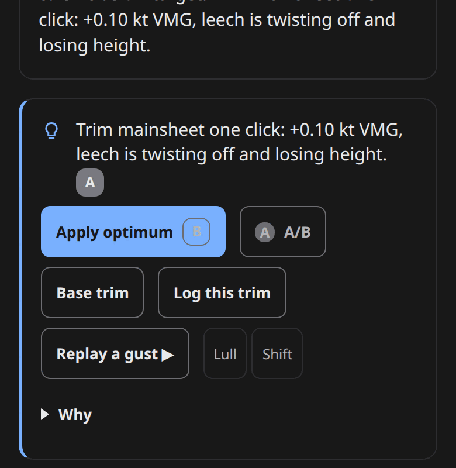

**Impact.** About 120 px of an 844 px viewport — roughly 14 % of the phone's
first screen — spent restating the sentence directly above it, on a screen that
is already 6.1 viewports long and where the hero has been pushed below the fold
([H-11](#h-11)).

**Principle.** Research §3 principles 4 (one screen) and 14 (prefer state over
data).

**Fix.** On `max-width: 719px`, drop the verdict line from the band and keep the
insight card's version, which carries the tier badge and the actions. One
`display: none` in the phone media query.

**Effort.** S.

**Lenses.** phone.

### M-18 — Dock's regret card prints "Expected regret" twice, stacked

**Evidence.** Measured DOM order on `#/dock` at 390×844: `h2.section-title`
"Expected regret", then immediately the `InstrumentCell` whose label is also
"EXPECTED REGRET", with the B badge. Introduced by the phase-06 restyle
("`RegretCard` renders the expected regret (size `lg`) … through
`InstrumentCell`"), which added the cell without removing the card heading.

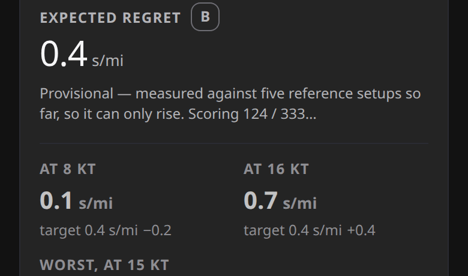

**Impact.** The first thing on Dock, on the narrowest surface, is its own title
said twice in two type styles. It reads as a rendering bug and costs a line of a
card that already has to fit a sparkline, three cells and a definition.

**Principle.** Research §3 principle 20 (two-tier hierarchy in every data cell).

**Fix.** Drop the `h2.section-title` from `RegretCard` and let the `lg` cell
label be the heading, giving it an `id` and the section an `aria-labelledby` so
the landmark keeps a name. Or keep the `h2` and pass no `label` to the cell.

**Effort.** S.

**Lenses.** phone.

### M-19 — The instrument band's "More" disclosure collides with the "More" nav tab on the same screen

**Evidence.** The band's collapse control is a 97×44 outlined pill labelled
"More" at document y 408, `aria-expanded="false"`, with no chevron and no
statement of what it reveals. The bottom nav's fifth destination is also labelled
"More" and is on screen simultaneously at 390×844. Expanding the pill reveals
TWA, HELM and the Analyse cells and relabels it "Less".

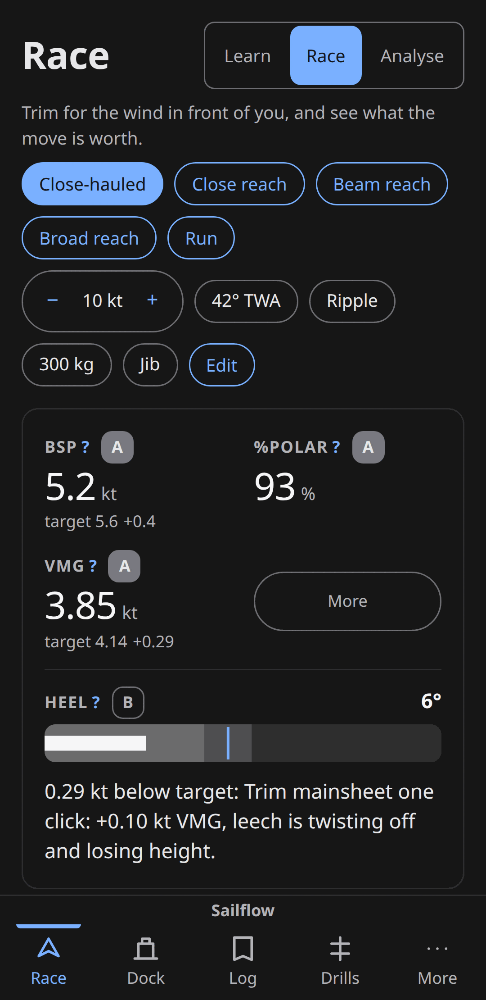

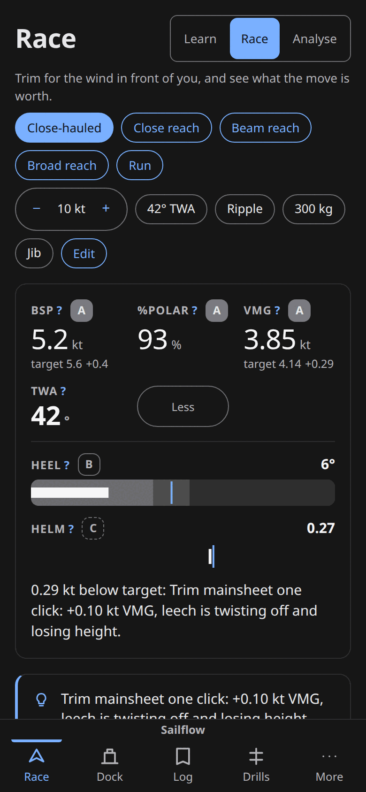

**Impact.** Two controls named "More" on one 390 px screen, one a route change
and one a disclosure — a novice tapping the wrong one leaves Race. The pill also
gives no cue that readings are hidden behind it, so the band silently
under-reports TWA and helm load on the device where they matter most.

**Principle.** Research §3 principle 18 (progressive disclosure is required, not
optional, for a trainer).

**Fix.** Rename to "More readings ▾" / "Fewer readings ▴" (or "+3 readings") and
add a chevron glyph. The string lives in `InstrumentBar.svelte` beside the
existing `aria-expanded` binding.

**Effort.** S.

**Lenses.** phone.

### M-20 — Race spends about 600 px of the phone's first screen on chrome before the first number

**Evidence.** Measured at 390×844: an `h1` "Race" of ~48 px plus the density
`Segmented`, a two-line lede (`src/ui/screens/Race.svelte:238`), then
`ConditionsStrip`'s five point-of-sail chips wrapping to two rows and six
condition chips (10 kt / 42° TWA / Ripple / 300 kg / Jib / Edit) wrapping to two
more. Instrument band top measures 302 px; the first numeric value lands at
~390 px. At 360×740 the same stack pushes the band lower against 104 px less
viewport.

**Impact.** More than a third of the viewport above the first reading, on a
screen ADR 0015 calls a cockpit. Compounds [H-11](#h-11): chrome + band +
duplicated verdict ([M-17](#m-17)) + actions is the entire first screen, with no
picture of the boat on it.

**Principle.** Research §3 principle 4 (one screen, no scrolling for the primary
cockpit).

**Fix.** On `max-width: 719px`: shrink the `h1` to `--text-lg` (the tab bar
already names the route), collapse the lede to a `
` or drop it after
first visit, and put the six condition chips behind the existing *Edit* sheet so
only the active point-of-sail chip and the TWS stepper stay inline.

**Effort.** M.

**Lenses.** phone.

### L-04 — Log's "New entry" / "Backup" row abuts the card below it with zero gap

**Evidence.** Measured at 390×844 on `#/log`: `h1` bottom 54, "New entry" button
60 → 104, the empty-state `.card` top 104 — a 0 px gap where every other card on
the screen has `--space-4`.

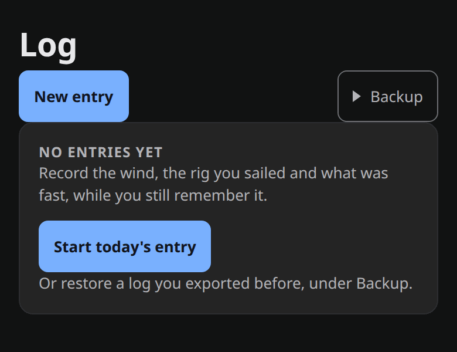

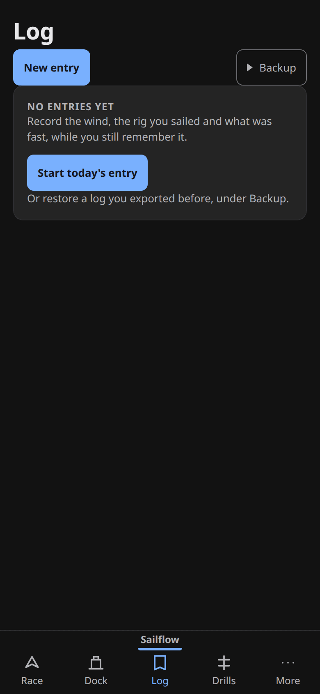

**Impact.** The two action buttons read as fused to the card border, which looks
like a layout break rather than a header row. Cosmetic; nothing is occluded or
unreachable.

**Principle.** Research §3 principle 25 (fixed spacing module at integer pixels).

**Fix.** `margin-bottom: var(--space-4)` — or a `gap` on the flex parent — on the
Log actions row in `src/ui/screens/Log.svelte`.

**Effort.** S.

**Lenses.** phone.
