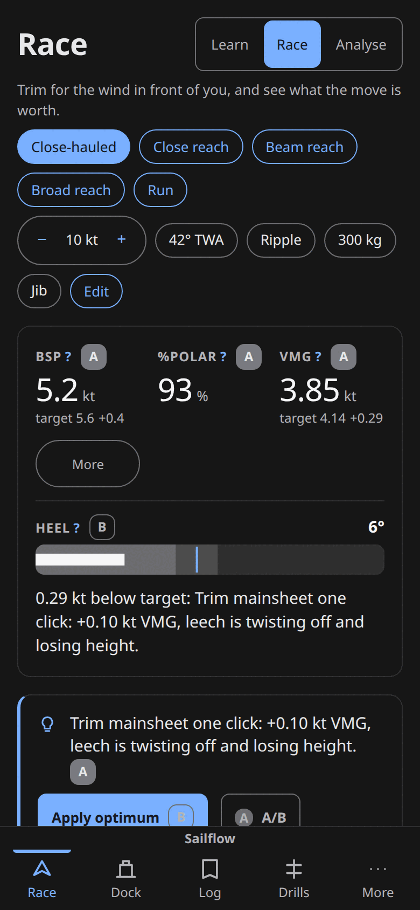
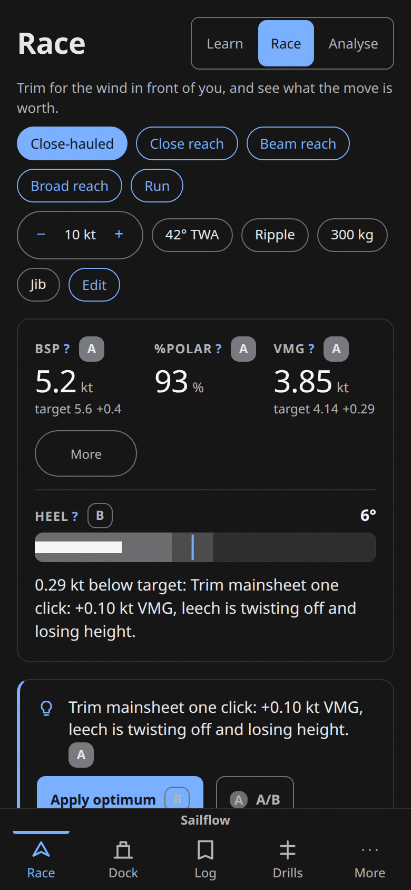
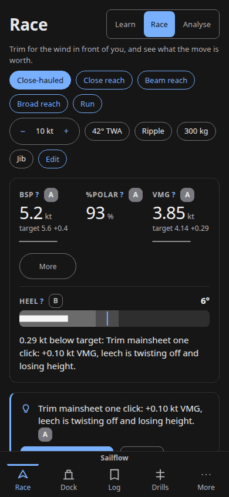
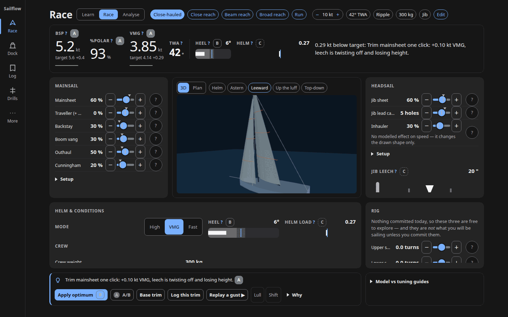
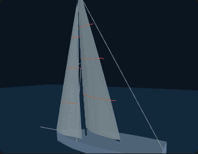
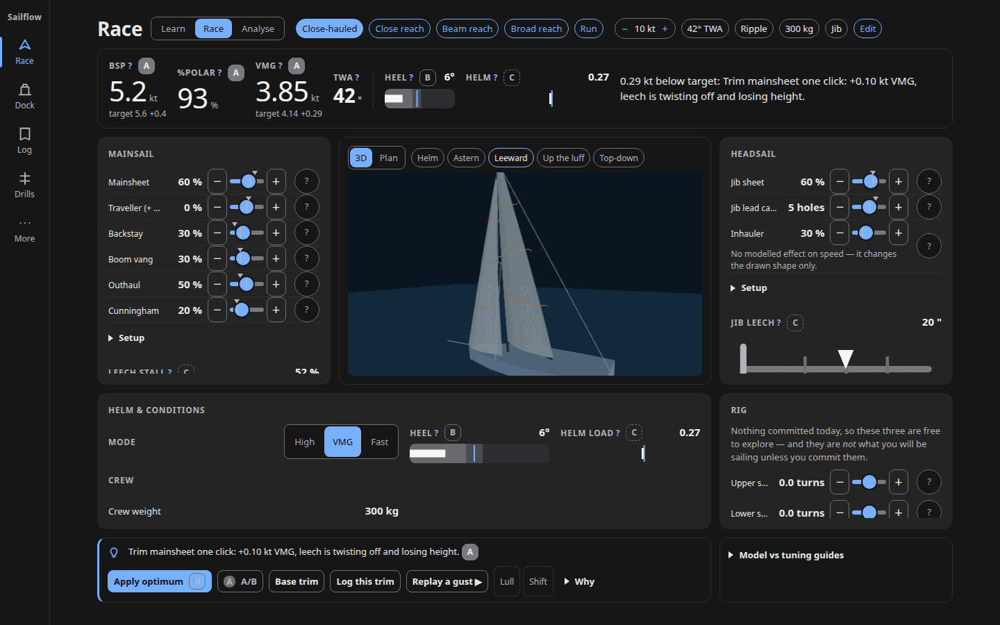
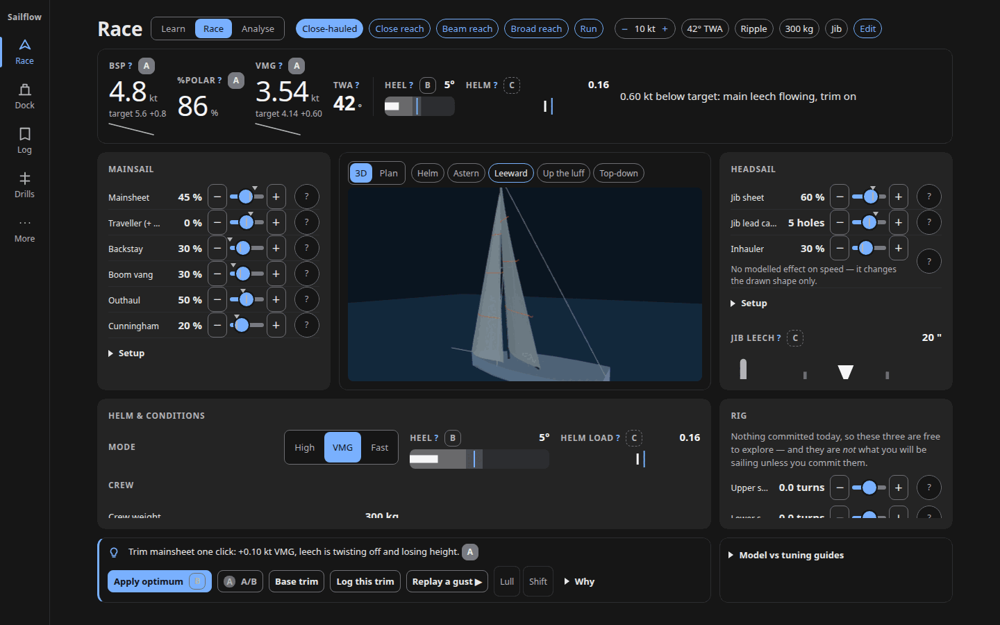
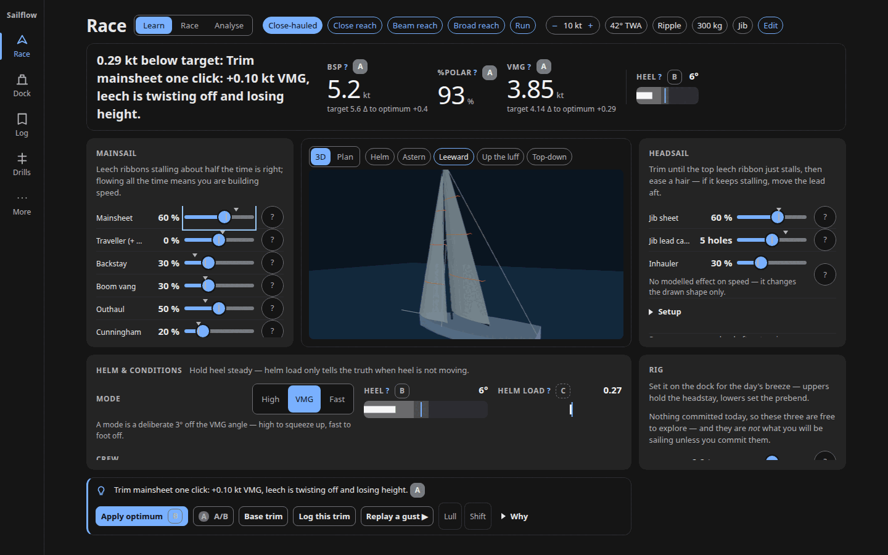
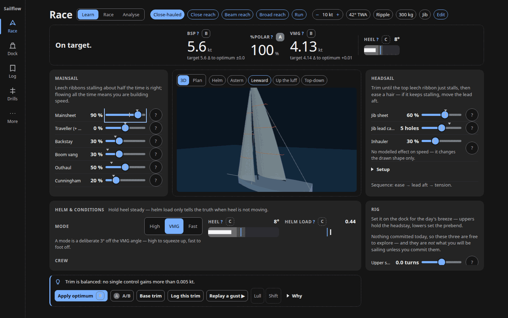

# Performance and the 3D hero

Findings against ADR 0014's three commitments — a lazy chunk that leaves first
load unchanged, a first-frame gate that falls back to 2D, and render-on-demand
rather than a continuous loop. The reduced-motion half of the third commitment is
filed with the accessibility lens as [H-09](02-accessibility.md#h-09), which
carries this lens's 60 fps measurements.

### H-12 — The 50 ms first-frame gate ADR 0014 committed to can never trip, because it times the one frame that is always cheap

**Evidence.** `src/ui/three/SailView3D.svelte:234-248` takes
`t0 = performance.now()` immediately before `renderer.render` and reports
`firstFrame - t0` on the **second** render; frame 1 — which pays context
creation, shader compilation and geometry upload — is explicitly discarded by the
`frames === 1 → dirty = true` branch. `src/ui/three/SailHero.svelte:127-129`
compares that warm number to `FIRST_FRAME_BUDGET_MS = 50` (`:29`).

Measured on a 390×844 phone viewport with rAF callbacks wrapped in an init script
and CDP `Emulation.setCPUThrottlingRate`:

| CPU throttle | frame 1 (discarded) | the frame the gate times | nav → `__sailViewReady` |
|---|---|---|---|
| 1× | 43.3 ms | 1.0 ms | 314 ms |
| 4× | 65.5 ms | 2.0 ms | 537 ms |
| 10× | 123.8 ms | 5.5 ms | 1,166 ms |
| 20× | 279.3 ms | 12.7 ms | 2,404 ms |

At every rate the gate passed, `tooSlow` never set, and the "3D ran slow on this
device" note (`SailHero.svelte:153-155`) never rendered.

A 20× throttle is a stand-in for a low-end Android and the margin there is still
4×, because `renderer.render` on a warm frame is GPU command submission, not the
work being budgeted for. This even holds under SwiftShader software rendering,
which the `freeze` comment at `SailHero.svelte:67-72` claims is "always over the
phone budget" — it is not, which is further evidence that the measured quantity
is the wrong one. `phase-04-three-d-hero.md:19` ticks the gate as done and no
test covers it (`grep` for `tooSlow` / `FIRST_FRAME` in `tests/` returns
nothing).

**Impact.** ADR 0014's central risk control is inert. The 2D fallback is
unreachable on every device except by the user finding the 3D/Plan toggle
themselves, and the ADR's revisit trigger — "the first-frame gate fails on the
owner's phone" — can never fire. On the exact device class the gate exists to
protect, the user gets a multi-second 3D stall instead of the designed fallback,
while docs and code assert the control is live.

**Principle.** ADR 0014 Decision ("shown only when WebGL is available and the
first frame renders inside 50 ms; otherwise the existing 2D plan view stays") and
the constant's own `prov:` comment at `SailHero.svelte:24-27` ("three frames at
60 Hz is the most a hero may cost before it is felt as a stall").

**Fix.** Keep the warm-frame number if it is useful, but gate on wall-clock time
to first frame: capture `t0 = performance.now()` in `onMount`
(`SailView3D.svelte:472`) and compare `performance.now() - t0` when
`frames === 1`. Re-pick the budget against the 43–279 ms real numbers in the same
change — frame 1 already hits 43.3 ms at 1× on a desktop, so a naive swap flips
the gate almost everywhere.

**Effort.** S.

**Lenses.** performance.

### M-21 — Every Race visit leaks a WebGL context and the whole detached Race DOM tree

**Evidence.** Playwright plus CDP `Performance.getMetrics`, with
`HeapProfiler.collectGarbage` forced before every read. Race ↔ Dock with the 3D
hero on: **+2,404 retained DOM nodes, +38.9 `JSEventListeners`, +1.9 WebGL
contexts per visit**, while live `document.getElementsByTagName('*').length`
stays pinned at 455. Linear, no plateau, through 25 cycles: 1,757 → 61,865 nodes,
26 → 998 listeners, 2.2 → 16.5 MB heap. The same loop with
`sailflow.hero.v1='plan'` is flat after warmup (nodes 2,672 → 2,672, listeners
29 → 29), and Dock ↔ Log, Log ↔ More and Drills ↔ More are all flat — it is
Race-with-3D only.

Two contexts per visit, decomposed. `src/ui/three/SailView3D.svelte:534` calls
`renderer?.dispose()` only; in three 0.185.1 `dispose()` does not drop the GL
context — that is a separate `forceContextLoss()`
(`node_modules/three/src/renderers/WebGLRenderer.js:593-598`, verified in the
installed version). The live context pins the canvas, the canvas pins its
detached parent chain, and the whole unmounted Race subtree stays reachable. The
second is `src/ui/three/SailHero.svelte:40-47` `hasWebGL()`, called per mount at
`:110`, which builds a throwaway canvas and `getContext('webgl2')` and never
releases it — plan mode still leaks +0.8 contexts per visit with no renderer at
all, which isolates it. `SailHero.svelte:91-98` names this exact ceiling in a
comment ("browsers only hand out about sixteen"). Chromium duly logged
`WARNING: Too many active WebGL contexts. Oldest context will be lost.` and
`webglcontextlost` began firing at visit 17.

The cleanup's material list at `:531` also misses four inline-constructed
materials (hull `:121`, deck `:125`, water `:175`) and the `GridHelper` at `:178`.

The lens's impact paragraph was refuted outright and is dropped: "once past ~16
contexts the browser force-loses them, leaving a permanently black hero with no
fallback" does not happen and structurally cannot. Chromium evicts oldest-first
and the live hero's context is always the newest, so it is never the target.
`gl.isContextLost()` on the attached canvas reads `false` after 25 visits and
again after 50 (100 contexts created), and the hero renders correctly in both.

Nobody should build `webglcontextlost`/`restore` handling on the strength of this
finding — none is needed, though none exists either (`grep` over `src/`: zero
hits).

**Impact.** A genuine unbounded resource leak on the app's own designed loop
(commit a rig on Dock, go trim it on Race). Over 25 visits the observed cost is
16.5 MB of JS heap and no visible degradation; at 50 visits still none. GPU-side
per-context cost is real and unmeasured here. That is invisible accumulation the
browser itself contains — friction, not a user-visible defect — which is why it
sits at Medium despite the two-line fix.

**Principle.** ADR 0014 Consequences ("render on demand"); the component's own
stated ceiling at `SailHero.svelte:91-98`.

**Fix.** Two lines. Call `renderer.forceContextLoss()` before
`renderer.dispose()` in the `SailView3D` cleanup, and hoist `hasWebGL()` to a
module-level memoised `const` so the probe context is created once per page load
rather than once per mount. Add the four missed materials to the disposal list
while there.

**Effort.** S.

**Lenses.** performance.

### M-22 — The phone downloads 142 KB gzip of three.js for a hero 372 px below the fold

**Evidence.** At 390×844 the hero canvas rect is `{x: 29, y: 1216, w: 332,
h: 257}` at `scrollY: 0`, against `innerHeight` 844 and `document.body.scrollHeight`
5178 — 372 px below the fold before the user scrolls. The chunk is fetched
anyway: 143,845 B transferred. After the two gate frames the
`IntersectionObserver` at `SailView3D.svelte:509-513` correctly parks the loop —
0 `gl.clear` in 6.0 s idle, and still 0 after a synthetic orbit drag on the
off-screen canvas.

Load timings, CDP `Network.emulateNetworkConditions` plus 4× CPU:

| network | FCP | chunk requested → arrived | first 3D frame |
|---|---|---|---|
| fast 4G | 448 ms | 549 → 762 ms | 1,029 ms |
| slow 4G | 1,112 ms | 1,331 → 2,174 ms | 2,448 ms |
| 3G | 3,568 ms | 4,380 → 7,616 ms | 7,942 ms |

Localhost desktop for reference: entry `index-BANmwX4z.js` 121.1 KB gzip /
382.1 KB raw, `solver.worker` 20.7 KB, pwa-register 0.6 KB, workbox-window
2.2 KB = 144.6 KB gzip of first-load JS; then `SailView3D-JU33RWUJ.js` requested
at 156 ms, **142.3 KB gzip / 569.6 KB raw** — 49.6 % of all the JS the default
screen ends up running.

The gate at `SailHero.svelte:109` is `shown`, computed from non-zero width
(`:99-106`), which is true for an off-screen element.

**Impact.** The default route (`DEFAULT_ROUTE = 'race'`,
`src/ui/router.svelte.ts:16`) roughly doubles its JS payload on a phone for a
picture the user has not scrolled to and that draws two frames and stops. On 3G
that is 3.2 s of download and a context creation competing with the solver for
the same slow CPU. Compounded by [H-11](03-phone.md#h-11), which is why the hero
is 1,216 px down in the first place.

**Principle.** ADR 0014 Decision ("loaded as a separate chunk only when the Race
screen mounts it") and Constraints ("a 380 px phone must still work").

**Fix.** Reuse the observer that already exists. Replace `SailHero`'s width-only
`shown` gate (`:99-106`) with an `IntersectionObserver` on the same `slot`
element, so the `import('./SailView3D.svelte')` effect at `:111-125` fires when
the hero first scrolls into view rather than when it has width. Zero-width copies
stay excluded for free, and the desktop cockpit — where the hero is above the
fold — is unaffected.

**Effort.** S.

**Lenses.** performance.

### M-23 — 13.8 KB gzip of honesty markdown and all five screens ride in the entry chunk

**Evidence.** `src/App.svelte:7-11` statically imports Race, Dock, Log, Drills
and More, so all five are in `index-BANmwX4z.js` (121.1 KB gzip / 382.1 KB raw).
`src/ui/screens/More.svelte:28-30` inlines `PROVENANCE.md?raw`,
`ASSUMPTIONS.md?raw` and `validation/report.md?raw` — 48,553 bytes of markdown,
13,829 gzipped, confirmed in the built entry
(`grep 'PROVENANCE' dist/assets/index-BANmwX4z.js` → true). That is 11.4 % of the
entry chunk, for text rendered inside a disclosure on the More tab. The pattern
for fixing it is already in the same file: `Kit` is a dynamic import
(`src/App.svelte:117`) with its own 3.3 KB chunk.

**Impact.** Every visitor pays 13.8 KB gzip of documentation plus four unopened
screens before the Race hero can start loading. On the 3G run in
[M-22](#m-22), FCP is 3,568 ms and the 3D chunk is not requested until 4,380 ms,
with the entry chunk's parse and execute directly in front of that. ADR 0014
asserts the first-load bundle is unchanged and CI checks it, but nothing checks
what is already in it.

**Principle.** ADR 0014 Consequences ("first-load bundle unchanged, asserted in
CI"); research §3 principle 13.

**Fix.** Move the three `?raw` imports behind an `await import()` inside the
disclosure that renders them, and make More (and Log, Drills) dynamic imports in
`App.svelte` the way `Kit` already is. `scripts/bundle_check.mjs` already asserts
the entry size, so the win shows up in CI as a lower baseline.

**Effort.** S.

**Lenses.** performance.

### M-24 — Each geometry rebuild allocates and frees ~14 GL buffers; a one-second slider drag churns 285

**Evidence.** Measured at 1440×900 by patching `createBuffer`, `deleteBuffer` and
`bufferData`: a 20-step, 1,045 ms mainsheet drag produced 285 buffers created and
285 deleted (273/s each way) and 285 `bufferData` uploads totalling 0.29 MB, at a
sustained 59 fps.

`applySail` (`SailView3D.svelte:310-326`) already does the right thing for the
two sail meshes — it writes into the existing attribute arrays and sets
`needsUpdate`. Everything else is rebuilt from scratch each time: `setLines`
(`:332-337`) disposes and re-creates a `BufferGeometry` for stripes, edges,
rigging and forestay; `tube()` (`:339-343`) builds a fresh `TubeGeometry` and the
caller removes and re-adds the mast and boom meshes on the scene graph
(`:451-463`) even when neither spar moved; `buildTelltales` (`:396-407`) rebuilds
six attribute buffers whose contents change only when the sail grid changes. The
`$effect` at `:540-544` lists every control, so `rebuild()` runs at slider event
rate rather than at solve rate.

**Impact.** 273 buffer create/destroy pairs per second of dragging is driver and
GC work on top of the render, on the exact interaction the cockpit exists for. On
a phone GPU that is where a drag stops feeling attached to the finger, and it is
invisible in a desktop measurement.

**Principle.** Research §3 principle 13 (~10 ms of work per frame, one rAF loop).

**Fix.** Give the four line meshes the same reuse path as `applySail`: pre-size a
`Float32Array` once, write into it, set `needsUpdate`, and reallocate only when
the vertex count changes. Skip the mast and boom rebuild entirely unless
`r.mast` / `r.boom` differ from the previous frame's points — mast bend moves
with backstay and shroud turns, not with mainsheet or jib sheet.

**Effort.** M.

**Lenses.** performance.

### M-25 — The 80 ms solve debounce is 33× the measured solve cost, so the instruments lag the slider by ~105 ms

**Evidence.** Worker round-trip measured by wrapping `Worker.prototype.postMessage`
and correlating ids over five settled mainsheet changes: `trimmed` n = 45, median
**2.4 ms** (min 1.5, max 4.7); `optimalTrim` n = 5, median 18.0 ms.
`DEBOUNCE_MS = 80` (`src/ui/race/store.svelte.ts:34`) is trailing-only, with no
leading edge and no max-wait (`request`, `:276-280`). Sampling the instrument
bar's text every 50 ms through a 20-step, 1 s drag gives 8 distinct states
(~7–9 Hz), and the settled value lands ~105 ms after the last input; on the
timeline the whole burst of 9 worker requests (1 solve + 8 finite-difference
probes, `#probe` at `:475-490`) is posted at +81 ms and every reply is back by
+84 ms. So ~80 of the ~105 ms is pure debounce waiting on a solver that answers
in 2.4 ms. Unchanged at 4× CPU throttle.

**Impact.** Research §3 principle 7 asks for feedback under ~100 ms and
continuous during drag, against B&G's 10 Hz reference; 105 ms and 7–9 Hz sit just
the wrong side of both. The 3D sail follows the slider live — its `$effect` reads
the controls directly — while the numbers beside it visibly trail, so the two
halves of the cockpit disagree about what the boat is doing during exactly the
interaction the panels were grouped for.

**Principle.** Research §3 principle 7 (feedback under ~100 ms and continuous
during drag).

**Fix.** Drop `DEBOUNCE_MS` to ~16 ms (one frame) for the main `trimmed` solve —
it costs 2.4 ms, and the id correlation at `store.svelte.ts:448,458` already
discards stale answers. Keep a longer trailing delay for the 8-probe coach pass
and the 18 ms `optimalTrim`, which are the only requests that need protecting
from a drag.

**Effort.** S.

**Lenses.** performance.

### L-05 — The production-gated Kit chunk is still precached

**Evidence.** `dist/sw.js` precaches `assets/Kit-r8nBQKs7.js` and
`assets/Kit-Com2kNRj.css` (3,277 + 563 = 3.8 KB gzip, 9.9 KB raw). The route is
gated in production behind `?kit=1` (`src/ui/router.svelte.ts:41-42`
`KIT_ENABLED`) and the component is a dynamic import (`src/App.svelte:117`) whose
comment states "a normal production visit never fetches the chunk" — true of the
import, false of the service worker, which fetches it on install regardless.
`SailView3D-JU33RWUJ.js` is correctly absent from the same precache list via the
`globIgnores` added in phase 04, so the mechanism exists and was simply not
extended.

**Impact.** 3.8 KB downloaded by every PWA install for a screen the code goes out
of its way to hide, and a comment a future reader will trust is wrong. Not a
regression of ux-02 L-01, which ticked the route and import gating — this is a
path that item did not cover.

**Principle.** ux-02 L-01 (kit gated out of production); ADR 0014 Consequences
(first-load payload discipline).

**Fix.** Add `Kit-*.js` and `Kit-*.css` to the existing `workbox.globIgnores` in
the Vite PWA config, beside the `SailView3D` entry already there.

**Effort.** S.

**Lenses.** performance.
